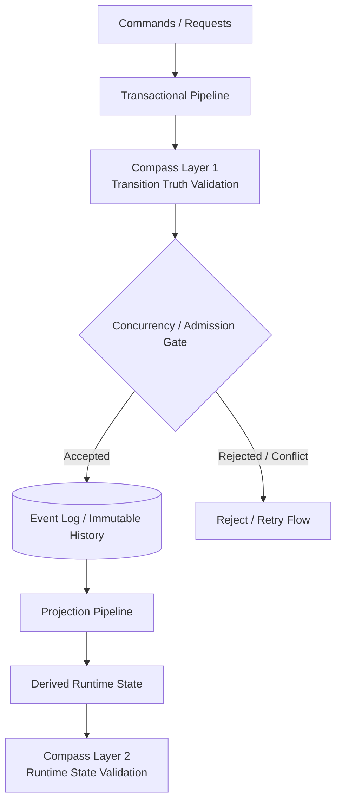

# 🧭 Streaming System + Compass

> ⚠️ This project is under active development. See [Current Status](#-current-status) for progress.

A failure-aware streaming system with invariant-driven correctness,  
validated through executable tests and later extended toward durable persistence, runtime semantic outcomes, and governance-oriented system reasoning.

---

## TL;DR

This is **not** a CRUD or ETL portfolio demo.

It is a production-inspired streaming-system project focused on:

- **accepted-history-first correctness**
- **semantic validation before persistence**
- **orthogonal idempotency / concurrency boundaries**
- **replay-safe projection runtime design**
- **exact-money hardening before durable persistence**
- **snapshot trust as derived-state replay efficiency, not source-of-truth replacement**
- **SemanticOutcome as the first runtime semantic interpretation boundary**

The project currently has:

- a completed write-side transactional baseline
- Compass Layer 1 transition-truth validation
- a Stage 3 baseline projection runtime with reducer / worker separation
- a completed Stage 3.5A decimal / money hardening step before durable persistence
- a completed Stage 3.5B durable write-side baseline, including PostgreSQL-backed accepted history, durable idempotency, transactional write-side execution, two-phase concurrency admission, and validation placement strategy
- Stage 3.5C PR0 durable order-event vocabulary hardening, including uppercase `event_type` vocabulary, `proof_prev_status` database constraint, and stream-position unique-constraint rename
- a completed Stage 3.5C durable read-side baseline, including PostgreSQL-backed projection state, checkpoint progress, global-position projection worker orchestration, and durable replay / rebuild validation
- a completed Stage 3.5D snapshot trust / replay-efficiency baseline, including projection snapshot schema, store, replay validator, snapshot-assisted state resolver, and aggregate snapshot trust deferral
- a completed Stage 3.5E durable history and permission hardening baseline, including database role / privilege boundaries, accepted-history mutation hardening tests, derived-state mutation permission tests, and a minimal actor metadata boundary
- a completed Stage 4A SemanticOutcome core, including runtime technical-status mapping, read-side / snapshot outcome mapping, and write-side admission outcome mapping
- executable tests defending write-side, read-side, durable replay, snapshot trust, durable permission-boundary, and Stage 4A runtime semantic-outcome semantics

Stage 4A is now complete at the SemanticOutcome core level.

The current implementation focus is:

- **Stage 4B — DecisionReceipt / DiagnosticTrace**

Stage 4B continues the roadmap from structured semantic outcomes toward durable decision receipts, diagnostic traces, measurement evidence, runtime decision policy, strategy selection, retry governance, and later action safety.

---

## Guide for Reviewers

If you only have a short amount of time:

- **1 minute**
  - read [Current Status](#-current-status)
  - scan the [High-Level Architecture](docs/architecture/high_level_architecture.md)

- **3 minutes**
  - read [Why Compass Split into Two Layers](docs/adr/0004_why_compass_split_into_two_layers.md)
  - read [Projection Pipeline](docs/architecture/projection_pipeline.md)

- **5 minutes**
  - read [Projection Boundary](docs/boundary_notes/projection_boundary.md)
  - read [Transactional Core](docs/architecture/transactional_core.md)
  - scan `tests/` and the Stage 3 projection worker / reducer path

If you want to understand how the repository thinks rather than only what it implements:

- read [Learning and Design Methodology](docs/philosophy/00_learning_and_design_methodology.md)
- read [Postmortems](docs/postmortems/README.md)

---

## Sharp Project Highlights

- **Accepted-history-first design**  
  Candidate events are not trusted merely because they can be written. Accepted history is protected by semantic validation and admission boundaries.

- **Layered semantic defense**  
  Compass is intentionally split into write-side transition-truth validation and later runtime state validation.

- **Orthogonal idempotency and concurrency boundaries**  
  Retry safety and stale-write protection are treated as different problems, not collapsed into one mechanism.

- **Replay-safe projection baseline**  
  The Stage 3 projection runtime uses reducer / worker separation and replay / rebuild through the same runtime path.

- **Exact-money pre-persistence hardening**  
  Stage 3.5A completed the migration from float-based money handling to Decimal-based semantics before durable persistence work expands.

- **Durable write-side baseline**  
  Stage 3.5B establishes PostgreSQL-backed accepted history, durable idempotency, transactional write-side execution, two-phase concurrency admission, and configurable validation placement.

- **Durable read-side baseline**  
  Stage 3.5C establishes PostgreSQL-backed projection state, checkpoint progress, global-position worker orchestration, and durable replay / rebuild validation against accepted history.

- **Snapshot trust / replay-efficiency baseline**  
  Stage 3.5D establishes projection snapshot schema, snapshot storage, snapshot-assisted replay validation, snapshot-assisted state resolution, and aggregate snapshot trust deferral.

- **Completed minimal actor / permission boundary**  
  Stage 3.5E completes the database role / privilege baseline, accepted-history mutation hardening, derived-state mutation permission tests, and minimal actor metadata boundary before Stage 4.

- **Stage 4A SemanticOutcome core is complete**  
  Stage 4A completed the transition from technical validation evidence into structured `SemanticOutcome` mapping for read-side, snapshot, and write-side admission outcomes.

- **Stage 4B DecisionReceipt / DiagnosticTrace is now the active branch direction**  
  Stage 4B should preserve semantic outcomes and evidence in durable receipts and traces before policy, strategy selection, and retry governance are introduced.

- **Documentation as architecture memory**  
  ADRs, boundary notes, postmortems, and philosophy notes are used to preserve why the system is shaped this way.

---

## 🔥 Project Positioning

This project is a production-inspired streaming system designed to solve three fundamental problems:

1. **Transactional Correctness**  
   Ensure state transitions are logically valid.

2. **Runtime Semantic Integrity**  
   Ensure derived runtime state remains faithful to accepted history.

3. **Failure Resilience under Adversarial Conditions**  
   Maintain correctness even under failures.

---

## 🧠 Core Insight

> One event stream, two semantic worlds  
> The same data, interpreted under different system semantics

- Transactional Pipeline → state transition
- Read-Side / Runtime Pipeline → derived runtime truth

---

## 🏗️ High-Level Architecture



This architecture separates:

- **write-side admission**, where candidate events must pass semantic validation and concurrency-safe persistence
- **accepted immutable history**, where admitted events become the durable source of truth
- **read-side derivation**, where projection interprets accepted history into runtime state
- **runtime verification**, where Compass later validates whether projected state remains semantically correct

---

## ⚙️ Core Concepts

- Event-driven architecture
- Immutable event log as accepted history
- State as derived projection
- Invariant-driven validation through Compass
- Version-based admission and deterministic replay
- Clear separation between idempotency, concurrency control, and semantic validation

---

## 🔐 Compass: Semantic Validation and Governance

> Invariant = State Compression + Contract

Compass is the semantic validation layer of the system.

It begins with event-level transition truth validation and evolves toward runtime state verification, structured semantic outcomes, and later governance-oriented decisions.

At a high level:

- **Compass Layer 1** validates whether a candidate event truthfully follows accepted history.
- **Compass Layer 2** validates whether projected runtime state remains semantically correct.
- **Structured semantic outcomes** are the later bridge from raw failure detection toward reusable governance meaning.
- **Compass governance** later decides how the system should respond to violations.

Compass does not replace concurrency control.

Instead:

- Compass decides whether a candidate event is semantically trustworthy.
- The admission gate decides whether that candidate can still become the next accepted fact.
- Idempotency decides whether the external request has already been processed.

---

## 💣 Chaos Engineering

This system is intended to be validated through failure injection, including:

- poison messages
- partial commit failures
- duplicate events
- out-of-order events
- race conditions
- network jitter
- backpressure

Chaos scenarios do not define correctness.

They test whether the correctness mechanisms inside `src/` survive adversarial runtime conditions.

---

## 🎯 Key Principle

> A system is not correct because it works.  
> A system is correct because it preserves truth under failure.

---

## 🧪 What This Project Demonstrates

- Deterministic state recovery from accepted history
- Idempotent request handling with replay/conflict distinction
- Concurrency-safe event admission
- Candidate-event semantic validation before persistence
- Executable write-side invariants through tests
- Stage 3 baseline read-side projection runtime with reducer / worker separation
- Replay-safe projection state derivation with checkpoint-aware sequencing
- Decimal-based money semantics before durable persistence
- PostgreSQL-backed durable write-side persistence
- Two-phase concurrency admission through `prepare_stream(order_id)` and `append_if_admitted(candidate_event, expected_current_version)`
- Configurable validation placement through `IN_TRANSACTION` and `PRE_TRANSACTION`
- Durable order-event vocabulary hardening through uppercase `event_type` values, `proof_prev_status` CHECK constraints, and explicit stream-position constraint naming
- Projection snapshot trust as derived compression, validated and resolved without making snapshots authoritative
- Clear separation between domain legality, transition truth, admission continuity, retry safety, validation placement, read-side derivation, and snapshot trust

---

## ❌ This is NOT

- A CRUD system
- A simple ETL pipeline
- An AWS deployment demo
- A dashboard-first analytics project

---

## 🚀 This IS

A production-inspired streaming system focused on:

- correctness
- reliability
- failure modeling
- semantic validation
- replayable state reconstruction
- durable-boundary design before broader runtime complexity

---

## 📂 Project Structure

```text
streaming-system-compass/
├── src/                # Semantic core and execution logic
│   ├── core/           # Transactional domain core
│   ├── pipeline/       # Transactional / projection / analytical flows
│   ├── storage/        # Persistence abstractions
│   ├── compass/        # Semantic validation and governance
│   └── bootstrap/      # Composition roots / runtime assembly
├── chaos_engine/       # Failure injection and adversarial testing
├── experiments/        # Demo scripts and isolated experiments
├── docs/               # Philosophy, architecture notes, ADRs, domain specs, boundary notes, roadmaps, postmortems
├── tests/              # Unit, integration, replay, semantic-case, and adversarial baseline tests
├── README.md
└── .gitignore
```

### How to Run Tests

From the repository root:

```bash
pip install -r requirements.txt
pytest -v
```

Run a specific test directory:

```bash
pytest tests/integration -v
```

Some PostgreSQL-backed integration tests require local PostgreSQL, `TEST_DATABASE_URL`, and migrations.

For the full local PostgreSQL setup and destructive integration-test guardrails, see:

- [Development Setup](docs/development/README.md)
- [Local PostgreSQL Setup](docs/development/postgres_local_setup.md)

---

## 📚 Documentation

The full documentation index starts at [docs/README.md](docs/README.md).

Key documentation areas:

- [Design Philosophy](docs/philosophy/README.md) — working methodology and mental models behind IBO, Core / Enabler separation, and Compass-style semantic alignment
- [Architecture Notes](docs/architecture/README.md) — subsystem architecture and runtime boundaries
- [Architecture Decision Records](docs/adr/README.md) — major design decisions and trade-offs
- [Domain Specifications](docs/domain/README.md) — versioned business rules and domain semantics
- [Boundary Notes](docs/boundary_notes/README.md) — module ownership and responsibility boundaries
- [Roadmaps](docs/roadmap/README.md) — implementation sequencing and system evolution
- [Postmortems](docs/postmortems/README.md) — design lessons and boundary reflections

### Design Philosophy

This project is guided by a small set of mental models:

- **Input / Bridge / Output (IBO)** for reasoning across function, pipeline, and system scales
- **Core / Enabler separation** for distinguishing business meaning from reliability mechanisms
- **Map / Compass alignment** for adapting static design to runtime disturbance

These notes are collected in [Design Philosophy](docs/philosophy/README.md).

They are not implementation proof. They explain the reasoning model behind the architecture, while executable correctness belongs in `src/` and `tests/`.

### Recommended Reading Order

1. [High-Level Architecture](docs/architecture/high_level_architecture.md)
2. [Learning and Design Methodology](docs/philosophy/00_learning_and_design_methodology.md)
3. [Transactional Core](docs/architecture/transactional_core.md)
4. [Order Domain v1 Rules](docs/domain/order_domain_v1_rules.md)
5. [Stateless Registry and Concurrency Strategy Boundary](docs/adr/0001_registry_stateless_and_concurrency_strategy.md)
6. [Concurrency Control, Idempotency, and Retry Safety](docs/adr/0003_concurrency_idempotency_and_retry_safety.md)
7. [Intent-Aware Validation Dispatch for Compass Runtime](docs/adr/0002_intent_aware_validation_dispatch.md)
8. [Why Compass Split into Two Layers](docs/adr/0004_why_compass_split_into_two_layers.md)
9. [Compass Layers](docs/architecture/compass_layers.md)
10. [Projection Pipeline](docs/architecture/projection_pipeline.md)
11. [Implementation Roadmap](docs/roadmap/implementation_roadmap.md)
12. [Compass Runtime Roadmap](docs/roadmap/compass_runtime_roadmap.md)
13. [Boundary Notes](docs/boundary_notes/README.md)
14. [Postmortems](docs/postmortems/README.md)

This order starts from the top-level system shape, then moves into working methodology, write-side semantics, domain rules, transactional safety decisions, Compass validation architecture, projection evolution, and implementation sequencing.

For the mental models behind the architecture, see [Design Philosophy](docs/philosophy/README.md), especially the notes on learning/design methodology, IBO, and Core / Enabler separation.

---

## 🧩 Implementation Strategy

The implementation begins from the **transactional semantic core** under `src/core/order/`.

This means the project does **not** start from chaos injection, dashboards, analytics, or cloud deployment.

Instead, it starts by defining and implementing:

- domain event semantics
- aggregate rules
- state transitions
- proof / provenance structure
- idempotency boundary
- concurrency-safe admission boundary
- core transactional invariants

Everything else grows around this core:

- `storage/` persists accepted history, idempotency memory, and protects version continuity
- `pipeline/` executes transactional and projection flows, including PostgreSQL-backed write-side orchestration
- `compass/` validates semantic correctness
- `bootstrap/` assembles concrete runtime wiring
- `chaos_engine/` stress-tests whether mechanisms inside `src/` survive adversarial conditions

---

## 🧭 Roadmap

### Phase 1 — Deterministic Transactional Core

- transactional domain core
- event generation and replay
- idempotent request handling
- concurrency-safe admission / conditional persistence
- write-side consistency baseline

### Phase 2 — Event Truth Validation

- proof-carrying event structure
- event-level Compass validation
- transition truth checking before persistence
- validation dispatch and basic `ALLOW` / `BLOCK` policy

### Phase 3 — Projection Runtime + Exact-Money Hardening

- pure reducer
- checkpoint-aware projection worker
- projection state store
- checkpoint / offset handling
- replay and rebuild flow
- Decimal hardening before durable persistence

### Phase 3.5B / 3.5C / 3.5D / 3.5E — Durable Persistence and Replay Hardening

- Stage 3.5B durable write-side baseline completed
- Stage 3.5C durable read-side baseline completed
- PostgreSQL-backed accepted history and idempotency memory
- transactional event append + idempotency record persistence
- two-phase concurrency admission and validation placement strategy
- Stage 3.5C durable read-side schema, stores, worker orchestration, and replay validation completed
- durable projection state and checkpoint state
- global-position projection worker orchestration
- persistence-backed replay / rebuild validation
- Stage 3.5D snapshot trust, replay-efficiency, and persistence optimization completed
- pre-Stage 3.5E documentation alignment completed
- Stage 3.5E minimal actor / permission boundary completed
- exact money durability is already established at the baseline level
- durable accepted-history and permission hardening are now established as the pre-Stage 4 baseline

### Phase 4 — Runtime Semantic Governance

- SemanticOutcome core
- DecisionReceipt / runtime evidence record
- DiagnosticTrace / ResolutionTrace boundary
- Measurement Matrix / Cost Evidence Inventory
- narrow policy-contract boundary for the current order/payment domain
- RuntimeDecisionPolicy
- Layer 1 / Layer 2 outcome-family alignment
- StrategySelector / fast-path health policy
- Retry Governance / attempt classification

### Phase 5 — Action Safety / Dual-Dimension Governance Demo

- reviewer-facing action-safety demo
- semantic correctness × operational freshness / runtime trust
- execute / block decision for externally meaningful actions
- clear implementation vs future-work boundary

### Phase 6 — Later Production and Agent-Facing Hardening

- benchmark suite if needed
- evidence retention policy
- cost-aware semantic governance
- projection delivery layer if needed
- isolated derived-state runtime / oblivious agent runtime evaluation when Stage 4 and Stage 5 foundations are stable
- broader adversarial hardening


---

## 🚧 Current Status

This repository is being built incrementally toward the full system design described above.

Current baseline completed:

- transactional semantic core under `src/core/order/`
- minimal `INIT -> CREATED -> PAID` write-side model
- accepted-history event store and replay baseline
- request-level idempotency with replay/conflict distinction
- optimistic admission gate for append-time continuity protection
- optimistic concurrency collision coverage for stale-write rejection
- Compass Layer 1 transition-truth validation
- runtime assembly through `src/bootstrap/`
- Stage 3 baseline projection runtime:
  - pure reducer
  - checkpoint-aware worker
  - in-memory projection state store
  - in-memory checkpoint store
  - replay / rebuild baseline
- Stage 3.5A exact-money hardening before durable persistence:
  - Decimal-based money semantics
  - aligned fixtures / unit / integration / semantic / adversarial / demo paths
  - formal projection reducer path as the only replay-reduction truth path
- Stage 3.5B durable write-side baseline:
  - PostgreSQL-backed accepted history through `PostgresEventStore`
  - PostgreSQL-backed idempotency memory through `PostgresIdempotencyStore`
  - transactional event append and idempotency record persistence
  - two-phase concurrency admission through `prepare_stream(order_id)` and `append_if_admitted(candidate_event, expected_current_version)`
  - validation placement strategy for `IN_TRANSACTION` and `PRE_TRANSACTION`
- Stage 3.5C durable read-side baseline:
  - durable order-event vocabulary hardening
  - durable read-side schema for `projection_states` and `projection_checkpoints`
  - PostgreSQL-backed `PostgresProjectionStore`
  - PostgreSQL-backed `PostgresCheckpointStore`
  - `order_events.global_position`
  - PostgreSQL-backed projection worker orchestration
  - durable replay / rebuild validation against accepted history
  - PostgreSQL schema, storage, worker, and replay-validation tests
- Stage 3.5D snapshot trust / replay-efficiency baseline:
  - snapshot trust contract boundary
  - durable projection snapshot schema
  - PostgreSQL-backed `PostgresProjectionSnapshotStore`
  - projection snapshot-assisted replay validator
  - projection snapshot-assisted state resolver
  - aggregate snapshot trust boundary / deferral decision
  - write-side aggregate snapshot schema/store and snapshot-assisted write-side rehydration explicitly deferred

Current boundary of completion:

- write-side transactional baseline is established
- durable write-side persistence is established
- read-side projection baseline exists in deterministic in-memory form
- exact-money semantics are stabilized before deeper durable persistence work
- durable accepted-history vocabulary has been hardened before read-side persistence depends on stored events
- durable read-side projection state, checkpoint progress, global-position worker orchestration, and replay / rebuild validation are established through Stage 3.5C
- Stage 3.5D snapshot trust, persistence optimization, and replay efficiency is complete at the read-side projection snapshot baseline level
- write-side aggregate snapshot schema/store and snapshot-assisted write-side rehydration are intentionally deferred
- Stage 3.5E durable history and permission hardening is complete
- Stage 4A SemanticOutcome core is complete

Current implementation focus:

- Stage 4B — DecisionReceipt / DiagnosticTrace

Stage 4A closeout is complete at the runtime semantic interpretation level.

Next implementation milestones:

- Stage 4B DecisionReceipt / DiagnosticTrace: durable runtime evidence records, diagnostic traces, evidence shape, and correlation boundaries
- Stage 4C+ runtime decision policy, StrategySelector, and retry governance
- Stage 5 dual-dimension governance demo / action safety

---

## 🧪 Development Note

This repository began with a documentation-first development approach.

The architecture, ADRs, domain rules, and boundary notes were written before the main transactional implementation to make ownership, invariants, and failure boundaries explicit.

That documentation-first phase has now been translated into an executable baseline across:

- `src/core/order/`
- `src/storage/`
- `src/pipeline/transactional/`
- `src/pipeline/projection/`
- `src/compass/transition/`
- `src/bootstrap/`
- `tests/`

The repository remains intentionally conservative:

- documentation defines semantic intent and ownership boundaries
- `src/` implements runtime logic
- `tests/` make selected invariants and failure paths executable
- the current Stage 3 baseline remains intentionally minimal and in-memory
- Stage 3.5A has hardened exact-money semantics before persistence expands
- later phases will extend this baseline from Stage 4B receipt / trace work toward runtime decision policy, Stage 5 action safety, and production / agent-facing hardening

---

## 📄 Notice and Usage

This repository is shared as a personal design research project and professional portfolio.

Unless otherwise noted:

* Source code is not currently licensed for reuse, redistribution, or modification.
* Documentation, notes, diagrams, and written materials are licensed under the Creative Commons Attribution 4.0 International License (CC BY 4.0).

You may share and adapt the written materials with proper attribution.

Please attribute written materials as:

```text
Compass Framework / Streaming System Compass documentation by Yen-Hua Chen.
Licensed under CC BY 4.0.
Original source: https://github.com/hikaru-212/streaming-system-compass
```

For usage, redistribution, attribution, and permission details, see [NOTICE.md](NOTICE.md).

For the documentation content license text, see [LICENSE-CONTENT.md](LICENSE-CONTENT.md).

---

## 📌 Author Note

This project focuses on system correctness under failure, not just successful execution under ideal conditions.

The main logic of correctness lives in `src/`.

`chaos_engine/` exists to test whether those correctness mechanisms can survive real failure conditions.

The documentation follows one main principle:

> Explain the boundary before explaining the implementation.
