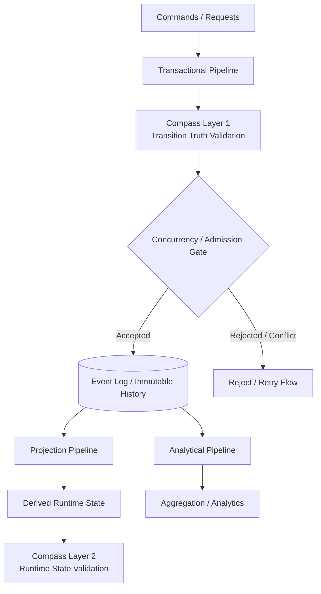

# 🧭 Streaming System + Compass

> ⚠️ This project is under active development. See [Current Status](#-current-status) for progress.

A failure-aware streaming system with invariant-driven correctness,  
validated through executable tests and later hardened through chaos engineering.

---

## 🔥 Project Positioning

This project is a production-inspired streaming system designed to solve three fundamental problems:

1. **Transactional Correctness**  
   Ensure state transitions are logically valid.

2. **Analytical Observability**  
   Extract insights from streaming data.

3. **Failure Resilience under Adversarial Conditions**  
   Maintain correctness even under failures.

---

## 🧠 Core Insight

> One event stream, two semantic worlds  
> The same data, interpreted under different system semantics

- Transactional Pipeline → state transition
- Analytical Pipeline → statistical signal

---

## 🏗️ High-Level Architecture



This architecture separates:

- **write-side admission**, where candidate events must pass semantic validation and concurrency-safe persistence
- **accepted immutable history**, where admitted events become the durable source of truth
- **read-side derivation**, where projection and analytics interpret the accepted event stream under different goals
- **runtime verification**, where Compass later validates projected state and governance outcomes

---

## ⚙️ Core Concepts

- Event-driven architecture
- Immutable event log as accepted history
- State as derived projection
- Invariant-driven validation through Compass
- Version-based admission and deterministic replay
- Clear separation between idempotency, concurrency control, and semantic validation

---

## 🔐 Compass: Semantic Validation and Governance

> Invariant = State Compression + Contract

Compass is the semantic validation layer of the system.

It begins with event-level transition truth validation and evolves toward runtime state verification and governance.

At a high level:

- **Compass Layer 1** validates whether a candidate event truthfully follows accepted history.
- **Compass Layer 2** validates whether projected runtime state remains semantically correct.
- **Compass governance** later decides how the system should respond to violations.

Compass does not replace concurrency control.

Instead:

- Compass decides whether a candidate event is semantically trustworthy.
- The admission gate decides whether that candidate can still become the next accepted fact.
- Idempotency decides whether the external request has already been processed.

---

## 💣 Chaos Engineering

This system is intended to be validated through failure injection, including:

- poison messages
- partial commit failures
- duplicate events
- out-of-order events
- race conditions
- network jitter
- backpressure

Chaos scenarios do not define correctness.

They test whether the correctness mechanisms inside `src/` survive adversarial runtime conditions.

---

## 🎯 Key Principle

> A system is not correct because it works.  
> A system is correct because it survives failure.

---

## 🧪 What This Project Demonstrates

- Deterministic state recovery from accepted history
- Idempotent request handling with replay/conflict distinction
- Concurrency-safe event admission
- Candidate-event semantic validation before persistence
- Executable write-side invariants through tests
- Clear separation between domain legality, transition truth, admission continuity, and retry safety

---

## ❌ This is NOT

- A CRUD system
- A simple ETL pipeline
- An AWS deployment demo
- A dashboard-first analytics project

---

## 🚀 This IS

A production-inspired streaming system focused on:

- correctness
- reliability
- failure modeling
- semantic validation
- replayable state reconstruction

---

## 📂 Project Structure

```text
streaming-system-compass/
├── src/                # Semantic core and execution logic
│   ├── core/           # Transactional domain core
│   ├── pipeline/       # Transactional / projection / analytical flows
│   ├── storage/        # Persistence abstractions
│   ├── compass/        # Semantic validation and governance
│   └── bootstrap/      # Composition roots / runtime assembly
├── chaos_engine/       # Failure injection and adversarial testing
├── experiments/        # Demo scripts and isolated experiments
├── docs/               # Philosophy, architecture notes, ADRs, domain specs, boundary notes, roadmaps, postmortems
├── tests/              # Unit, integration, replay, semantic-case, and adversarial baseline tests
├── README.md
└── .gitignore
```

### Test Structure

`tests/` is organized by test intent rather than only by source module:

- `unit/` — module-level legality, invariant, and boundary tests
- `integration/` — multi-boundary transactional flow tests
- `semantic_cases/` — intentionally malformed candidate/history cases for Compass validation
- `adversarial/` — replay, duplicate, out-of-order, and pre-chaos disturbance scenarios
- `shared/` — shared replay helpers and common test-side utilities
- `experiments/` — smoke tests for demo entry wiring

### How to Run Tests

Run the full test suite from the repository root:

```bash
pytest -v
```

Run a specific test directory:

```bash
pytest tests/integration -v
```

---

## 📚 Documentation

The full documentation index starts at [docs/README.md](docs/README.md).

Key documentation areas:

- [Design Philosophy](docs/philosophy/README.md) — mental models behind IBO, Core / Enabler separation, and Compass-style semantic alignment
- [Architecture Notes](docs/architecture/README.md) — subsystem architecture and runtime boundaries
- [Architecture Decision Records](docs/adr/README.md) — major design decisions and trade-offs
- [Domain Specifications](docs/domain/README.md) — versioned business rules and domain semantics
- [Boundary Notes](docs/boundary_notes/README.md) — module ownership and responsibility boundaries
- [Roadmaps](docs/roadmap/README.md) — implementation sequencing and system evolution
- [Postmortems](docs/postmortems/README.md) — design lessons and boundary reflections

### Design Philosophy

This project is guided by a small set of mental models:

- **Input / Bridge / Output (IBO)** for reasoning across function, pipeline, and system scales
- **Core / Enabler separation** for distinguishing business meaning from reliability mechanisms
- **Map / Compass alignment** for adapting static design to runtime disturbance

These notes are collected in [Design Philosophy](docs/philosophy/README.md).

They are not implementation proof. They explain the reasoning model behind the architecture, while executable correctness belongs in `src/` and `tests/`.

### Recommended Reading Order

1. [High-Level Architecture](docs/architecture/high_level_architecture.md)
2. [Transactional Core](docs/architecture/transactional_core.md)
3. [Order Domain v1 Rules](docs/domain/order_domain_v1_rules.md)
4. [Stateless Registry and Concurrency Strategy Boundary](docs/adr/0001_registry_stateless_and_concurrency_strategy.md)
5. [Concurrency Control, Idempotency, and Retry Safety](docs/adr/0003_concurrency_idempotency_and_retry_safety.md)
6. [Intent-Aware Validation Dispatch for Compass Runtime](docs/adr/0002_intent_aware_validation_dispatch.md)
7. [Compass Layers](docs/architecture/compass_layers.md)
8. [Projection Pipeline](docs/architecture/projection_pipeline.md)
9. [Implementation Roadmap](docs/roadmap/implementation_roadmap.md)
10. [Compass Runtime Roadmap](docs/roadmap/compass_runtime_roadmap.md)
11. [Boundary Notes](docs/boundary_notes/README.md)
12. [Postmortems](docs/postmortems/README.md)

This order starts from the top-level system shape, then moves into write-side semantics, domain rules, transactional safety decisions, Compass validation architecture, projection evolution, and implementation sequencing.

For the mental models behind the architecture, see [Design Philosophy](docs/philosophy/README.md), especially the notes on IBO and Core / Enabler separation.

---

## 🧩 Implementation Strategy

The implementation begins from the **transactional semantic core** under `src/core/order/`.

This means the project does **not** start from chaos injection, dashboards, analytics, or cloud deployment.

Instead, it starts by defining and implementing:

- domain event semantics
- aggregate rules
- state transitions
- proof / provenance structure
- idempotency boundary
- concurrency-safe admission boundary
- core transactional invariants

Everything else grows around this core:

- `storage/` persists accepted history and protects version continuity
- `pipeline/` executes transactional and projection flows
- `compass/` validates semantic correctness
- `bootstrap/` assembles concrete runtime wiring
- `chaos_engine/` stress-tests whether mechanisms inside `src/` survive adversarial conditions

---

## 🧭 Roadmap

### Phase 1 — Deterministic Transactional Core

- transactional domain core
- event generation and replay
- idempotent request handling
- concurrency-safe admission / conditional persistence
- write-side consistency baseline

### Phase 2 — Event Truth Validation

- proof-carrying event structure
- event-level Compass validation
- transition truth checking before persistence
- validation dispatch and basic `ALLOW` / `BLOCK` policy

### Phase 3 — Projection Runtime

- incremental projection worker
- projection state store
- checkpoint / offset handling
- replay and rebuild flow
- crash recovery semantics

### Phase 4 — State-Level Compass Verification

- projected state invariants
- checkpoint validation
- replay vs incremental consistency checks
- semantic runtime verification

### Phase 5 — Analytical Pipeline

- event-time processing
- windowed aggregation
- lateness-aware handling
- statistical materialization

### Phase 6 — Governance and Chaos Hardening

- advanced governance policy actions
- warning / quarantine / audit behavior
- evidence logging
- semantic alerts
- adversarial failure validation through chaos scenarios

---

## 🚧 Current Status

This repository is being built incrementally toward the full system design described above.

Current baseline completed:

- transactional semantic core under `src/core/order/`
- minimal `INIT -> CREATED -> PAID` write-side model
- accepted-history event store and replay baseline
- request-level idempotency with replay/conflict distinction
- optimistic admission gate for append-time continuity protection
- optimistic concurrency collision coverage for stale-write rejection
- Compass Layer 1 transition-truth validation
- multi-layer executable tests for transactional legality, replay safety, transition-truth checks, semantic-case and adversarial-history scenarios
- runtime assembly through `src/bootstrap/`

Current boundary of completion:

- write-side transactional baseline is established
- failure-path reasoning is now meaningfully executable through tests
- read-side projection runtime is not yet implemented

Next implementation milestone:

- build the first projection worker
- introduce projection state storage and rebuild flow
- define projection-side replay and checkpoint semantics
- begin the physical read-side runtime split from the transactional runtime

---

## 🧪 Development Note

This repository began with a documentation-first development approach.

The architecture, ADRs, domain rules, and boundary notes were written before the main transactional implementation to make ownership, invariants, and failure boundaries explicit.

That documentation-first phase has now been translated into an initial executable baseline across:

- `src/core/order/`
- `src/storage/`
- `src/pipeline/transactional/`
- `src/compass/transition/`
- `src/bootstrap/`
- `tests/`

The repository remains intentionally conservative:

- documentation defines semantic intent and ownership boundaries
- `src/` implements the runtime logic
- `tests/` makes selected invariants and failure paths executable
- later phases will extend this baseline into projection runtime, state-level Compass checks, and adversarial hardening

---

## 📄 Notice and Usage

This repository is shared as a personal design research project and professional portfolio.

No open-source license has been granted yet. All rights are reserved unless a license is added later.

For usage, redistribution, attribution, and permission details, see [NOTICE.md](NOTICE.md).

---

## 📌 Author Note

This project focuses on system correctness under failure, not just successful execution under ideal conditions.

The main logic of correctness lives in `src/`.

`chaos_engine/` exists to test whether those correctness mechanisms can survive real failure conditions.

The documentation follows one main principle:

> Explain the boundary before explaining the implementation.
