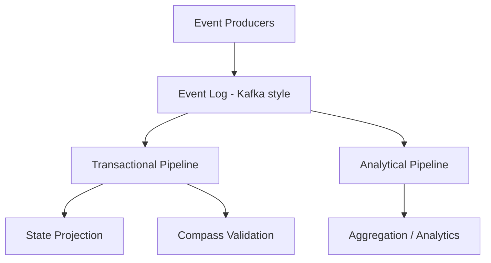

# 🧭 Streaming System + Compass

> ⚠️ This project is under active development. See "Current Status" for progress.

A failure-aware streaming system with invariant-driven correctness,  
validated through chaos engineering.

---

## 🔥 Project Positioning

This project is a production-inspired streaming system designed to solve three fundamental problems:

1. **Transactional Correctness**  
   Ensure state transitions are logically valid

2. **Analytical Observability**  
   Extract insights from streaming data

3. **Failure Resilience under Adversarial Conditions**  
   Maintain correctness even under failures

---

## 🧠 Core Insight

> One event stream, two semantic worlds
> The same data, interpreted under different system semantics

- Transactional Pipeline → state transition  
- Analytical Pipeline → statistical signal  

---

## 🏗️ High-Level Architecture



---

## ⚙️ Core Concepts

- Event-driven architecture  
- Immutable event log (source of truth)  
- State = derived projection  
- Invariant-driven validation (Compass)  

---

## 🔐 Compass (Invariant System)

> Invariant = State Compression + Contract

This allows the system to validate correctness using minimal observable state.

The system enforces:

- Valid state transitions  
- Continuous ordering  
- Deterministic replay  

---

## 💣 Chaos Engineering (Key Feature)

This system is validated through failure injection, including:

- Poison messages  
- Partial commit failures  
- Out-of-order events  
- Race conditions  
- Network jitter  
- Backpressure  

These scenarios are not theoretical — they are actively simulated and validated.

---

## 🎯 Key Principle

> A system is not correct because it works  
> A system is correct because it survives failure

---

## 🧪 What This Project Demonstrates

- Deterministic state recovery  
- Idempotent event processing  
- Failure-aware system design  
- Runtime invariant validation  

---

## ❌ This is NOT

- A CRUD system  
- A simple ETL pipeline  
- An AWS deployment demo  

---

## 🚀 This IS

A production-inspired streaming system focused on:

- correctness  
- reliability  
- failure modeling  

---

## 📂 Project Structure

```text
streaming-system-compass/
├── src/                # Core system logic
│   ├── pipeline/       # Transactional & analytical pipelines
│   ├── storage/        # Database interactions
│   └── compass/        # Invariant validation system
├── chaos_engine/       # Failure injection system
│   └── scenarios/      # Chaos scenarios (partial commit, etc.)
├── experiments/        # Demo scripts for showcasing behavior
├── streaming_patterns/ # Algorithm → system mapping
├── README.md
└── .gitignore
```

---

## 🧭 Roadmap

### Phase 1 — Deterministic Transactional Core
- Event processing pipeline
- Idempotent state projection
- Offset management

### Phase 2 — Failure Handling & Chaos Injection
- Partial commit recovery
- Poison message handling (DLQ)
- Out-of-order event buffering

### Phase 3 — Compass (Invariant Engine)
- Runtime invariant validation
- Semantic violation detection
- Policy-driven enforcement

### Phase 4 — Analytical Pipeline
- Event-time processing
- Windowed aggregation
- Lateness-aware handling

### Phase 5 — Advanced System Evolution
- Drift detection
- Adaptive failure policies
- Distributed scaling

---

## 🚧 Current Status

This repository is being built incrementally toward the full system design described above.

Current focus:
- repository structure
- project specification
- architecture definition

Next implementation milestone:
- minimal transactional projection flow
- idempotent event processing
- partial commit failure demo

---

## 📌 Author Note

This project focuses on system correctness under failure,  
not just successful execution under ideal conditions.


