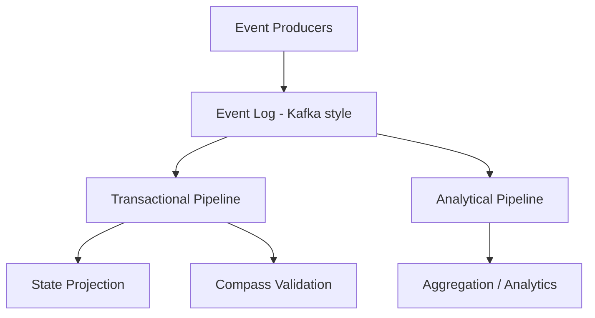

# 🧭 Streaming System + Compass

> ⚠️ This project is under active development. See "Current Status" for progress.

A failure-aware streaming system with invariant-driven correctness,  
validated through chaos engineering.

---

## 🔥 Project Positioning

This project is a production-inspired streaming system designed to solve three fundamental problems:

1. **Transactional Correctness**  
   Ensure state transitions are logically valid

2. **Analytical Observability**  
   Extract insights from streaming data

3. **Failure Resilience under Adversarial Conditions**  
   Maintain correctness even under failures

---

## 🧠 Core Insight

> One event stream, two semantic worlds  
> The same data, interpreted under different system semantics

- Transactional Pipeline → state transition  
- Analytical Pipeline → statistical signal  

---

## 🏗️ High-Level Architecture



---

## ⚙️ Core Concepts

- Event-driven architecture  
- Immutable event log (source of truth)  
- State = derived projection  
- Invariant-driven validation (Compass)  

---

## 🔐 Compass (Invariant System)

> Invariant = State Compression + Contract

This allows the system to validate correctness using minimal observable state.

The system enforces:

- Valid state transitions  
- Continuous ordering  
- Deterministic replay  

---

## 💣 Chaos Engineering (Key Feature)

This system is validated through failure injection, including:

- Poison messages  
- Partial commit failures  
- Out-of-order events  
- Race conditions  
- Network jitter  
- Backpressure  

These scenarios are not theoretical — they are actively simulated and validated.

---

## 🎯 Key Principle

> A system is not correct because it works  
> A system is correct because it survives failure

---

## 🧪 What This Project Demonstrates

- Deterministic state recovery  
- Idempotent event processing  
- Failure-aware system design  
- Runtime invariant validation  

---

## ❌ This is NOT

- A CRUD system  
- A simple ETL pipeline  
- An AWS deployment demo  

---

## 🚀 This IS

A production-inspired streaming system focused on:

- correctness  
- reliability  
- failure modeling  

---

## 📂 Project Structure

```text
streaming-system-compass/
├── src/                # Semantic core and execution logic
│   ├── core/           # Transactional domain core (first implementation focus)
│   ├── pipeline/       # Transactional / projection / analytical flows
│   ├── storage/        # Persistence abstractions
│   └── compass/        # Invariant validation and semantic governance
├── chaos_engine/       # Failure injection and adversarial testing
├── experiments/        # Demo scripts and isolated experiments
├── docs/               # Architecture notes, roadmaps, boundary notes, postmortems
├── tests/              # Unit / integration / replay / invariant / chaos tests
├── README.md
└── .gitignore
```

---

## 🧩 Implementation Strategy

The implementation begins from the **transactional semantic core** under `src/core/order/`.

This means the project does **not** start from chaos injection or analytics first.  
Instead, it starts by defining:

- domain event semantics  
- aggregate rules  
- state transitions  
- proof / provenance structure  
- core transactional invariants  

Everything else grows around this core:

- `storage/` persists and replays the core history  
- `pipeline/` executes transactional and projection flows  
- `compass/` validates semantic correctness  
- `chaos_engine/` stress-tests whether the mechanisms inside `src/` survive adversarial conditions  

---

## 🧭 Roadmap

### Phase 1 — Deterministic Transactional Core
- transactional domain core
- event generation and replay
- idempotent event processing
- write-side consistency baseline

### Phase 2 — Event Truth Validation
- proof-carrying event structure
- event-level Compass validation
- transition truth checking before persistence

### Phase 3 — Projection Runtime
- incremental projection worker
- projection state store
- checkpoint / offset handling
- replay and rebuild flow

### Phase 4 — State-Level Compass Verification
- projected state invariants
- checkpoint validation
- replay vs incremental consistency checks
- semantic runtime verification

### Phase 5 — Analytical Pipeline & Chaos Hardening
- event-time processing
- windowed aggregation
- lateness-aware handling
- adversarial failure validation through chaos scenarios

---

## 🚧 Current Status

This repository is being built incrementally toward the full system design described above.

Current focus:
- repository structure
- domain boundary definition
- transactional semantic core under `src/core/order/`

Next implementation milestone:
- minimal order event model
- aggregate state transition logic
- event store and idempotency baseline
- first Compass transition validation path

---

## 📌 Author Note

This project focuses on system correctness under failure,  
not just successful execution under ideal conditions.

The main logic of correctness lives in `src/`.  
`chaos_engine/` exists to test whether those correctness mechanisms can survive real failure conditions.
