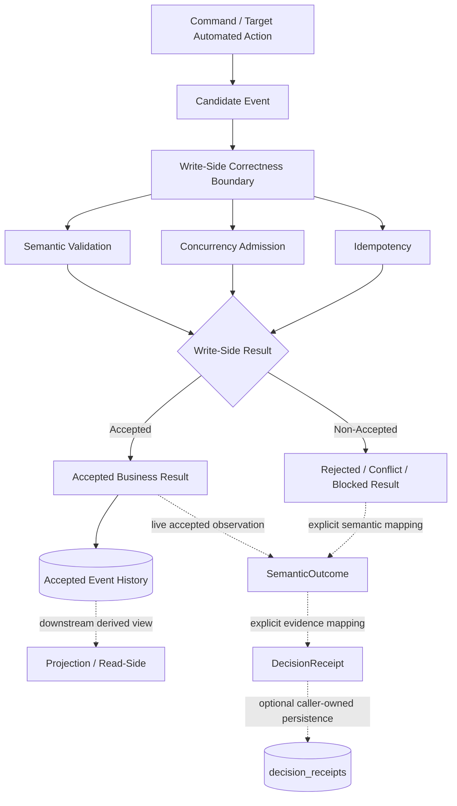

# 🧭 Streaming System + Compass

**Semantic Governance for Event-Driven & AI Agent Systems**

> A system is not correct because it works.
> A system is correct because it preserves truth under failure.

[](https://python.org)
[](#current-status)
[](docs/README.md)

---

## The problem Compass attacks

A database can tell you a write committed.

Concurrency control can tell you the write was still admissible.

Idempotency can tell you the request was already seen.

None of them, by themselves, answer the harder question:

> **Should this action ever have become an accepted fact?**

Compass draws a hard line:

```text
Candidate Action  ≠  Accepted Fact
```

An action only becomes system truth after its semantic claims and admission conditions are validated against authoritative history.

This boundary already matters in concurrent event-driven systems.

It becomes critical once automated actors — including AI agents — can change real state.

---

## What Compass is

Compass is a production-inspired correctness and governance system built around one question:

> **What must be true before an attempted action is allowed to become an accepted fact?**

The current implementation provides:

* **accepted-history-first correctness**
* semantic validation before acceptance
* explicit separation of semantic validation, concurrency admission, and idempotency
* PostgreSQL-backed durable write-side execution
* durable projection and replay validation
* runtime semantic interpretation through `SemanticOutcome`
* structured governance evidence through `DecisionReceipt`
* a machine-readable Order Correctness Contract
* a generic immutable `RuntimeDecision` contract and first reviewed Layer-1
  PostgreSQL / Order write-side evaluation profile

Producer-specific execution traces and bounded measurement evidence support this foundation without acting as general tracing or measurement platforms.

Compass is not a CRUD demo, an ETL pipeline, or an agent framework.

It is a reference system for reasoning about **semantic correctness under concurrency, retry, replay, partial failure, and increasingly automated execution**.

---

## The core boundary

```text
Command / Target Automated Action
                  ↓
           Candidate Action
                  ↓
     Write-Side Correctness Boundary
                  ↓
          Typed Producer Result
             ↙           ↘
      accepted             typed non-accepted
          ↓                     ↓
   Accepted History       Semantic Observation
```

These responsibilities are deliberately separate.

* **Semantic validation** asks whether the proposed transition tells the truth.
* **Concurrency admission** asks whether it may still become the next accepted fact.
* **Idempotency** asks whether this external intent has already been processed.

Passing one does not imply passing the others.

That separation is one of the core architectural constraints of Compass.

---

## Architecture


```mermaid
flowchart TD
    A[Command / Target Automated Action] --> B[Candidate Event]

    B --> C[Write-Side Correctness Boundary]

    C --> C1[Semantic Validation]
    C --> C2[Concurrency Admission]
    C --> C3[Idempotency]

    C1 --> D{Write-Side Result}
    C2 --> D
    C3 --> D

    D -- Accepted --> AR[Accepted Business Result]
    D -- Non-Accepted --> R[Rejected / Conflict / Blocked Result]

    AR --> E[(Accepted Event History)]
    AR -. live accepted observation .-> S[SemanticOutcome]

    R -. explicit semantic mapping .-> S

    S -. explicit evidence mapping .-> J[DecisionReceipt]
    J -. optional caller-owned persistence .-> K[(decision_receipts)]

    E -. downstream derived view .-> P[Projection / Read-Side]
```

> **Accepted history is authoritative. Live observations and derived state are evidence about that authority — not replacements for it.**

An accepted result has two distinct lifecycles:

```text
Accepted Business Result
├── durable business authority → Accepted Event History
└── live semantic evidence      → SemanticOutcome
```

The live path does not need to re-read accepted history before producing semantic evidence. If an immediate receipt is missing, a future reconciliation path may reconstruct a narrower canonical `DecisionReceipt` from accepted history, but that is a separate and currently deferred recovery path.

A non-accepted result belongs to a different world. It creates no new accepted fact, but a rejected, conflicting, or blocked attempt may still carry semantic meaning and can therefore be mapped into `SemanticOutcome`.

Both accepted and non-accepted observations can reach `SemanticOutcome` because it is a shared **semantic interpretation boundary**, not a shared source of authority.

`DecisionReceipt` is structured governance evidence. It is neither accepted-history authority nor a mandatory next step for every `SemanticOutcome`; automatic production materialization remains deferred.

Projection and read-side state remain downstream derived views of accepted history. They are useful, but they do not become authoritative merely because they were derived from authoritative events.


---

## Why this matters for AI agents

AI agents do not invent a new correctness problem.

They make an existing one harder to ignore.

An automated action may:

* execute against stale context
* race another actor on the same aggregate
* retry after the world has changed
* reach the same technical endpoint through a different intent
* succeed technically while remaining semantically invalid

A successful tool call is not the same thing as a valid business fact.

Compass is **not an agent framework**.

Its role sits lower in the stack:

> establish the correctness and evidence boundaries that automated actions must pass before they are trusted as system truth.

Agent-facing action governance is the architectural target for this foundation, not a claim that an end-to-end agent runtime or tool interface is implemented today.

---

## What exists today

### Stable foundation

| Public architectural capability              | Status                                                                 |
| -------------------------------------------- | ---------------------------------------------------------------------- |
| Transactional semantic core                  | ✅ Complete                                                             |
| Accepted-history-first write model           | ✅ Complete                                                             |
| PostgreSQL accepted event history            | ✅ Complete                                                             |
| Durable idempotency                          | ✅ Complete                                                             |
| Concurrency-safe write admission             | ✅ Complete                                                             |
| Durable projection and replay validation     | ✅ Complete                                                             |
| `SemanticOutcome` interpretation             | ✅ Complete                                                             |
| `DecisionReceipt` evidence foundation        | ✅ Complete — explicit components; automatic materialization deferred   |
| Order Correctness Contract v0                | ✅ Complete                                                             |
| Stage 4C — Runtime Decision Authority        | ✅ Complete / closed — generic contract + first Layer-1 profile          |

Producer-specific execution traces and bounded PostgreSQL measurement evidence support this foundation. The existing permission work is a bounded database-role and accepted-history mutation-hardening baseline, not general IAM or business authorization.

### Current direction

| Responsibility                                  | Status                                                                     |
| ----------------------------------------------- | -------------------------------------------------------------------------- |
| Stage 4D — Strategy Selection Authority         | Responsibility retained; implementation deferred                          |
| Stage 4E — Retry / Attempt Authorization        | Next formal direction; first slice not implemented                         |
| Stage 5 — Action Safety                         | Future                                                                     |

Stage 4C is complete and closed. PR1 established the source-grounded
implementation-entry boundary; PR2 delivered the generic immutable
`RuntimeDecision` contract and first Layer-1 PostgreSQL / Order write-side
profile; Stage 4C.5 completed compatibility review and documentation closeout.
No additional Stage 4C production code is currently justified.

Detailed stage histories, ADRs, experiments, PR records, and closeouts live under [`docs/`](docs/).

---

## From evidence to authority

Compass keeps semantic interpretation, durable evidence, current-response authority, strategy, retry authorization, and execution separate:

```text
typed producer or read-side observation
                 ↓ explicit mapping
          SemanticOutcome
            ↙            ↘
live current evidence     DecisionReceipt
+ applicable exact rule        ↓ optional explicit persistence
refinement                durable governance evidence
        ↓
Stage 4C — Runtime Decision Authority
        ↓
permitted / required / denied
```

The receipt branch and live-decision branch are independent. Not every outcome is automatically persisted, and a live Stage 4C decision does not require receipt persistence first.

The responsibility vocabulary is precise:

* `SemanticOutcome` is live semantic interpretation of bounded technical evidence.
* `DecisionReceipt` is structured governance evidence that may be persisted explicitly.
* **Runtime Decision Authority** decides the generic current response within its approved boundary. It does not select strategy, authorize another attempt, or execute an action.
* **Strategy Selection Authority** selects `HOW` inside prior authorization only when multiple eligible strategies exist. Its responsibility is retained and implementation is deferred.
* **Retry / Attempt Authorization** alone decides whether another same-request invocation is allowed and under what constraints. It is the next formal implementation direction and remains unimplemented.
* execution remains separate from evidence, authorization, and strategy selection.

These responsibilities are non-linear. For one completed result:

```text
current evidence
→ Stage 4C current-response decision or refusal
→ caller handling
```

When another same-request invocation is considered:

```text
eligible prior-invocation evidence
→ Stage 4E authorization or refusal

if another invocation is authorized:
→ Stage 4D selects HOW only if multiple eligible strategies exist
→ execution
→ fresh result
→ Stage 4C handling when applicable
```

Stage 4C refusal is neither Stage 4E authorization nor Stage 4E refusal.
`C → D → E` is not a mandatory runtime pipeline.

---

## A small example

Two actors attempt to update the same order.

Both requests may be syntactically valid.

Both may represent individually reasonable actions.

One may even be based on a state that was correct only moments earlier.

Compass treats neither as truth merely because it exists.

```text
Actor A ──→ Candidate A
                    \
                     → semantic + concurrency admission
                    /
Actor B ──→ Candidate B

                     ↓

             Accepted History
```

Only admitted facts enter authoritative history.

Everything downstream reasons from what was actually accepted — not what was merely attempted.

---

## Key design principles

### Candidate ≠ Accepted

A proposed action does not become truth merely because it can be executed or persisted.

### Accepted history is authoritative

Derived state may be reconstructed, cached, snapshotted, or validated.

It does not replace accepted history.

### Correctness boundaries stay orthogonal

Semantic validity, concurrency safety, idempotency, persistence, runtime interpretation, and retry / attempt authorization solve different problems.

### Evidence before strategy

Runtime decisions should be grounded in structured evidence rather than inferred from a generic success/failure flag.

### Illegal semantic combinations should be difficult to represent

Finite correctness vocabularies are modeled as constrained relations rather than arbitrary combinations of individually valid values.

A model should not merely describe valid states.

Where practical, its supported construction path should make invalid states unrepresentable.

### Documentation preserves architecture memory

ADRs, boundary notes, postmortems, implementation records, and executable tests preserve not only what exists, but why the boundaries exist.

---

## Project structure

```text
streaming-system-compass/
├── src/
│   ├── core/           # Transactional domain core
│   ├── pipeline/       # Write-side and projection orchestration
│   ├── storage/        # Persistence boundaries
│   ├── compass/        # Semantic validation and governance
│   └── bootstrap/      # Runtime composition
├── chaos_engine/       # Failure-scenario documentation and placeholder infrastructure
├── experiments/        # Isolated mechanism experiments and demos
├── docs/               # Architecture, ADRs, boundaries, roadmaps, postmortems
└── tests/              # Unit, integration, replay, and semantic tests
    └── adversarial/    # Executable adversarial correctness tests
```

---

## Quick start

```bash
git clone https://github.com/hikaru-212/streaming-system-compass.git
cd streaming-system-compass

python3.12 -m venv .venv
./.venv/bin/python -m pip install -r requirements.txt
./.venv/bin/python -m pytest tests/unit -v
```

The command above runs the database-independent unit suite. The full test suite is PostgreSQL-backed and requires:

* a full Git clone with complete repository history
* PostgreSQL 16
* a dedicated test database
* `TEST_DATABASE_URL` pointing to that test database
* all repository migrations applied in order

After that setup, run:

```bash
./.venv/bin/python -m pytest -v --durations=10
```

CI uses Python 3.12, a PostgreSQL 16 service, the migrated test database, and coverage enforcement. Database fixtures may destructively reset test tables, so do not point `TEST_DATABASE_URL` at a development or production database.

See:

* [Development Setup](docs/development/README.md)
* [Local PostgreSQL Setup](docs/development/postgres_local_setup.md)

---

## Documentation

This README is a map, not the full architecture record.

Start here:

* [Compass Reading Path](docs/navigation/COMPASS_READING_PATH.md) — route by purpose and depth
* [Compass in the Agent Era](docs/overview/compass_agent_era_overview.md) — public orientation and current/future boundary
* [Documentation Index](docs/README.md) — architecture, ADRs, implementation records, postmortems, and reasoning notes

For the current decision-governance boundary:

* [ADR 0027 — Separate Runtime Decision, Strategy, and Retry Authority](docs/adr/0027_separate_runtime_decision_strategy_and_retry_authority.md)
* [Stage 4C — Live Decision Governance](docs/implementation_notes/stage_4c/README.md)
* [Stage 4C Closeout](docs/implementation_notes/stage_4c/stage_4c_closeout.md)

Deep documents preserve architecture history and implementation chronology; the reading path indicates which sources are current authority and which are historical context.

Project participation:

* [Contributing](CONTRIBUTING.md) — environment, test workflows, change boundaries, and pull requests
* [Security Policy](SECURITY.md) — security-sensitive scope and responsible reporting guidance

---

## Who this is for

Compass may be useful if you are thinking about:

* event-sourced or event-driven correctness under concurrency
* semantic validation beyond schema validation
* durable governance evidence for audit and recovery
* replay and derived-state trust
* retry / attempt authorization
* automated or AI-driven systems that can change authoritative state

If you only need a simple CRUD service or a lightweight agent prototype, this project is intentionally over-engineered for that problem.

If the difficult question is:

> **How do I know this successful action was actually allowed to become truth?**

that is the problem Compass is built to explore.

---

## Philosophy

> **Clarify the boundary before scaling the implementation.**

Compass treats unclear ownership and mixed responsibilities as correctness risks.

At every layer, it tries to keep one distinction explicit:

```text
What happened?
≠
What does it mean?
≠
What should the system do next?
```

---

## Current status

Compass is an active personal design-research and reference implementation.

The project has completed the durable correctness, semantic-evidence,
Order correctness-contract, and Stage 4C Runtime Decision Authority foundations.

```text
Stage 4C — complete / closed
Stage 4D — responsibility retained; implementation deferred
Stage 4E — next formal implementation direction; not implemented
Stage 5  — future action-safety / dual-dimension governance
```

Detailed stage history, architecture decisions, experiments, and closeouts live
under [`docs/`](docs/).

The goal is not to claim production readiness early.
It is to make the correctness boundary explicit before broader automation
depends on it.

---

## License and attribution

Software and executable repository content are licensed under the [Apache License 2.0](LICENSE).

Documentation, diagrams, and other prose or research materials are licensed under the [Creative Commons Attribution 4.0 International License](https://creativecommons.org/licenses/by/4.0/) (CC BY 4.0).

For documentation attribution, a suggested form is:

```text
Streaming System + Compass documentation by Yen-Hua Chen.
Licensed under CC BY 4.0.
Original source: https://github.com/hikaru-212/streaming-system-compass
```

The exact content-role boundary, including executable experiments, Markdown examples, and recorded benchmark evidence, is documented in [LICENSE-CONTENT.md](LICENSE-CONTENT.md).

See:

* [LICENSE](LICENSE)
* [NOTICE.md](NOTICE.md)
* [LICENSE-CONTENT.md](LICENSE-CONTENT.md)

---

## Final note

Compass began as a streaming-system correctness project.

Its scope has gradually moved toward a broader question:

> **How should a system decide whether an attempted action deserves to become authoritative truth — especially when the actor is increasingly automated?**

The implementation is being built from the correctness boundary outward.

**Not from the demo inward.**

If you are thinking about the same boundary — especially how automated actions should be governed before they become system truth — discussion and critique are welcome.
