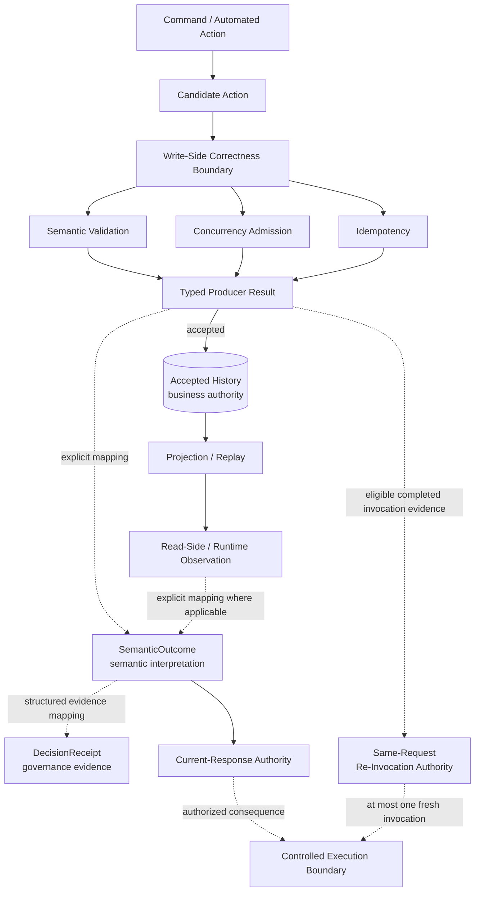

# 🧭 Streaming System + Compass

**Semantic Governance for Event-Driven & AI Agent Systems**

> A system is not correct because it works.<br>
> A system is correct because it preserves truth under failure.

[](https://python.org)
[](#status)
[](docs/README.md)

---

## The problem Compass attacks

A database can tell you a write committed.

Concurrency control can tell you whether a write was still admissible.

Idempotency can tell you whether a request was already processed.

None of them, by themselves, answer the harder question:

> **Should this action ever have been allowed to become an accepted fact?**

Compass draws a hard line:

```text
Candidate Action
!=
Accepted Fact
```

An action may be syntactically valid, technically executable, authorized to call a tool, or selected by multiple agents.

That still does not make it business truth.

Compass makes the boundary between **attempted action**, **evidence**, **authority**, and **accepted truth** explicit.

---

## What Compass is

Compass is a production-inspired correctness and governance reference implementation built around one question:

> **What must be true before an attempted action is allowed to become trusted system truth?**

The executable foundation includes:

- accepted-history-first write semantics;
- semantic validation before acceptance;
- explicit separation of semantic validation, concurrency admission, and idempotency;
- PostgreSQL-backed durable write-side execution;
- durable projection and replay validation;
- `SemanticOutcome` for runtime semantic interpretation;
- `DecisionReceipt` for structured governance evidence;
- an Order Correctness Contract with stable rule identities;
- current-response authority over reviewed runtime evidence;
- bounded same-request re-invocation authority from reviewed prior-invocation evidence.

Compass is **not** a CRUD demo, an ETL pipeline, or an agent framework.

It is infrastructure for systems where technical success is not enough to establish semantic authority.

---

## The core boundary

```text
Command / Automated Action
            ↓
      Candidate Action
            ↓
 Write-Side Correctness Boundary
            ↓
     Typed Producer Result
        ↙           ↘
   accepted      non-accepted
      ↓               ↓
Accepted History   Semantic Evidence
```

These responsibilities remain separate:

- **Semantic validation** asks whether the proposed transition tells the truth.
- **Concurrency admission** asks whether it may still become the next accepted fact.
- **Idempotency** asks whether this external intent has already been processed.

Passing one does not imply passing the others.

> **Derived state is useful. Accepted history is authoritative.**

---

## Architecture


```mermaid
flowchart TD
    A["Command / Automated Action"] --> B["Candidate Action"]
    B --> C["Write-Side Correctness Boundary"]

    C --> V["Semantic Validation"]
    C --> Q["Concurrency Admission"]
    C --> I["Idempotency"]

    V --> P["Typed Producer Result"]
    Q --> P
    I --> P

    P -- "accepted" --> H[("Accepted History<br/>business authority")]
    P -. "explicit mapping" .-> S["SemanticOutcome<br/>semantic interpretation"]

    H --> R["Projection / Replay"]
    R --> O["Read-Side / Runtime Observation"]
    O -. "explicit mapping where applicable" .-> S

    S -. "structured evidence mapping" .-> D["DecisionReceipt<br/>governance evidence"]

    S --> C4["Current-Response Authority"]
    P -. "eligible completed invocation evidence" .-> E4["Same-Request<br/>Re-Invocation Authority"]

    C4 -. "authorized consequence" .-> X["Controlled Execution Boundary"]
    E4 -. "at most one fresh invocation" .-> X
```

The diagram is a responsibility map, not one mandatory runtime pipeline.

In particular:

```text
evidence
!=
authority

current-response authority
!=
another-invocation authority

authorization
!=
execution
```

Dynamic strategy selection remains a separate responsibility and is deliberately deferred until one authorized operation has multiple genuinely eligible execution paths.

---

## Why this matters for AI agents

AI agents do not invent a new correctness problem.

They make an existing one harder to ignore.

An automated actor may:

- execute against stale context;
- race another actor on the same aggregate;
- choose a workflow path that changes which facts become reachable;
- generate a technically valid but semantically inadmissible candidate;
- agree with other agents on a remediation that still violates authoritative policy;
- influence the premises of a deterministic business rule without directly mutating the final state.

A successful tool call is not the same thing as a valid business fact.

A useful agent-era model is:

```text
Authoritative Facts / Deterministic Rules
                ↓
        Should AI participate?
                ↓
       Delegation Boundary
                ↓
       What may AI influence?
                ↓
        Candidate Action
                ↓
        Semantic Admission
                ↓
     Accepted / Trusted Outcome
                ↓
 Consequence-Specific Authority
                ↓
       Controlled Execution
```

Two rules follow:

> **Do not probabilize what the authoritative system already knows how to decide deterministically.**

> **Agreement does not create semantic authority.**

---

## From evidence to authority

The completed Stage 4 architecture separates understanding from consequence authority.

```text
technical evidence
        ↓
semantic interpretation
        ↓
structured evidence
        ↓
consequence-specific authority
        ↓
controlled execution
```

For a human-operated system, the evidence boundary may be enough.

Once downstream consequences move into an autonomous runtime, workflow engine, recovery controller, or AI agent, the previously implicit human authority must become explicit.

```text
Stage 4B and earlier
= evidence / understanding system

Stage 4C+
= explicit machine consequence-authority boundary
```

See [ADR 0029 — Stage 4C+ Exists at the Automation Boundary](docs/adr/0029_stage_4c_plus_exists_at_the_automation_boundary.md).

---

## What exists today

The core correctness and authority foundation is executable:

- accepted-history-first transactional writes;
- durable PostgreSQL event history and idempotency;
- supported optimistic and pessimistic concurrency-admission paths;
- semantic validation before accepted append;
- durable projections and replay validation;
- runtime `SemanticOutcome` interpretation;
- `DecisionReceipt` evidence components and persistence boundaries;
- producer-specific traces and bounded measurement evidence;
- the Order Correctness Contract;
- current-response authority;
- bounded same-request re-invocation authority.

The project does **not** currently claim:

- a general autonomous recovery loop;
- a production AI-agent runtime;
- dynamic runtime strategy selection;
- retry-until-success behavior;
- automatic A3 or general attempt scheduling;
- universal action authorization;
- Stage 5 external-effect safety.

Detailed stage and PR history lives under [`docs/`](docs/).

---

## Key design principles

### Candidate ≠ Accepted

A proposed action does not become truth merely because it can be executed or persisted.

### Technical capability ≠ business authority

Tool permission, database access, successful execution, or workflow reachability does not establish semantic permission for the resulting business effect.

### Agreement ≠ semantic authority

Voting, quorum, ranking, or multi-agent selection may choose a candidate.

They do not independently prove that the candidate may become trusted truth.

### Evidence ≠ authority

Structured evidence can explain what happened.

It does not authorize its own consequence.

### Authority ≠ execution

An authorized consequence still requires a controlled execution boundary.

### Fresh invocation ≠ resume old work

Re-observation must not silently reuse stale candidate, validation, or append state.

---

## Quick start

```bash
git clone https://github.com/hikaru-212/streaming-system-compass.git
cd streaming-system-compass

python3.12 -m venv .venv
./.venv/bin/python -m pip install -r requirements.txt
./.venv/bin/python -m pytest tests/unit -v
```

The unit command above is database-independent.

The full suite requires PostgreSQL 16, a dedicated test database, `TEST_DATABASE_URL`, and repository migrations:

```bash
./.venv/bin/python -m pytest tests -v --durations=10
```

Database fixtures may destructively reset test tables. Do not point `TEST_DATABASE_URL` at a development or production database.

See:

- [Development Setup](docs/development/README.md)
- [Local PostgreSQL Setup](docs/development/postgres_local_setup.md)

---

## Documentation

This README is a map, not the full architecture record.

Start here:

- [Compass Reading Path](docs/navigation/COMPASS_READING_PATH.md) — choose a route by purpose and depth
- [Compass in the Agent Era](docs/overview/compass_agent_era_overview.md) — public orientation
- [Semantic Admission](docs/semantic_admission/README.md) — candidate, authority, admission, and agent-era case studies
- [Documentation Index](docs/README.md) — architecture, ADRs, boundaries, implementation records, research, postmortems, and reasoning notes

Agent-era follow-up reading:

- [Consensus Is Not Semantic Authority](docs/semantic_admission/consensus_is_not_semantic_authority_rate_limiter.md)
- [Probabilistic Agency Inside Deterministic Business Workflows](docs/research/ai_governance/probabilistic_agency_inside_deterministic_business_workflows.md)
- [Invocation Completion Is Not Workflow Completion](docs/reasoning_notes/invocation_completion_is_not_workflow_completion.md)

Important current decisions:

- [ADR 0027 — Separate Runtime Decision, Strategy, and Retry Authority](docs/adr/0027_separate_runtime_decision_strategy_and_retry_authority.md)
- [ADR 0028 — Defer Dynamic Strategy Selection Until Multiple Eligible Execution Paths Exist](docs/adr/0028_defer_dynamic_strategy_selection_until_multiple_eligible_execution_paths_exist.md)
- [ADR 0029 — Stage 4C+ Exists at the Automation Boundary](docs/adr/0029_stage_4c_plus_exists_at_the_automation_boundary.md)

Project participation:

- [Contributing](CONTRIBUTING.md)
- [Security Policy](SECURITY.md)

---

## Who this is for

Compass may be useful if you care about:

- event-driven correctness under concurrency;
- semantic validation beyond schema checks;
- accepted-history and derived-state boundaries;
- runtime evidence and consequence-specific authority;
- automated systems that can change authoritative state;
- AI-agent workflows where tool capability, agreement, or planning must not silently become business authority.

If you only need a simple CRUD service or a lightweight agent prototype, this project is intentionally over-engineered for that problem.

If the difficult question is:

> **How do I know this successful action was actually allowed to become truth?**

that is the problem Compass is built to explore.

---

## Status

Active research and reference implementation.

The core correctness, semantic-evidence, current-response-authority, and bounded same-request re-invocation foundations are executable today.

Current follow-up work focuses on the public agent-era governance model and on testing whether the existing evidence and authority primitives can compose into a controlled autonomous recovery loop.

Stage 5 action safety for externally meaningful effects remains future work.

---

## License and attribution

Software and executable repository content are licensed under the [Apache License 2.0](LICENSE).

Documentation, diagrams, and other prose or research materials are licensed under the [Creative Commons Attribution 4.0 International License](https://creativecommons.org/licenses/by/4.0/) (CC BY 4.0).

For documentation attribution, a suggested form is:

```text
Streaming System + Compass documentation by Yen-Hua Chen.
Licensed under CC BY 4.0.
Original source: https://github.com/hikaru-212/streaming-system-compass
```

The exact content-role boundary is documented in [LICENSE-CONTENT.md](LICENSE-CONTENT.md).

See:

- [LICENSE](LICENSE)
- [NOTICE.md](NOTICE.md)
- [LICENSE-CONTENT.md](LICENSE-CONTENT.md)

---

## Final note

Compass began as a streaming-system correctness project.

Its scope has gradually moved toward a broader question:

> **How should a system decide whether an attempted action deserves to become authoritative truth — especially when the actor is increasingly automated?**

The implementation is being built from the correctness boundary outward.

**Not from the demo inward.**

If you are thinking about the same boundary — especially how automated actions should be governed before they become system truth — discussion and critique are welcome.
