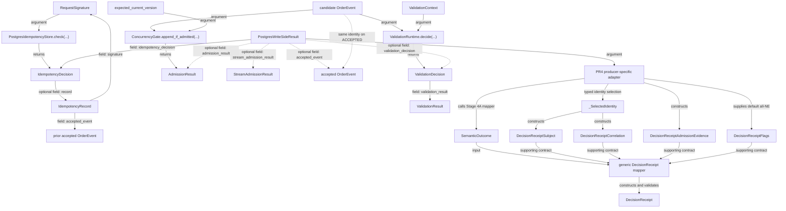

# Write-Side Mapping Type and Vocabulary Reference

This guide is a quick index for reading the Stage 3.5B → Stage 4A → Stage 4B PR4 code. Every name follows the current source contract.


## How to read this guide

For a class, enum, helper, or confusion pair, jump directly to the corresponding section. For the complete request lifecycle, read the [end-to-end flow](write_side_result_to_decision_receipt_end_to_end.md). For Stage 4A / Stage 4B ownership, read the [Stage 4A to Stage 4B Mapping Flow](stage_4a_to_stage_4b_write_side_mapping_flow.md).

## 1. Type dependency diagram



`IdempotencyRecord` retains only an already accepted event. An `OrderEvent` candidate is not accepted-history authority before append and commit. `_SelectedIdentity` is PR4's private normalized selection, not a write-side producer object. Sources: `src/storage/idempotency_store.py::IdempotencyRecord`, `src/compass/runtime/write_side_decision_receipt_mapping.py::_SelectedIdentity`.

## 2. Class/interface reference

| Class / interface | Defined in | Created by | Consumed by | Core question / important fields | Authority meaning / must not be confused with |
|---|---|---|---|---|---|
| `RequestSignature` | `src/storage/idempotency_store.py::RequestSignature` | write-side command path | idempotency store | Which intent is defined by `request_id`, `command_type`, `order_id`, and `amount`? | request intent; not an accepted event or an automatic receipt-subject selector |
| `IdempotencyDecision` | `src/storage/idempotency_store.py::IdempotencyDecision` | `PostgresIdempotencyStore.check` | write side and Stage 4A/4B adapters | `verdict`, `reason`, optional `record` | authoritative or preliminary check result; not a semantic outcome |
| `IdempotencyRecord` | `src/storage/idempotency_store.py::IdempotencyRecord` | durable idempotency-store row conversion | replay/conflict handling and identity selection | retained `signature`, prior `accepted_event` | prior accepted-history evidence; in a conflict, not proof that the current attempt was accepted |
| `StreamAdmissionResult` | `src/pipeline/transactional/admission.py::StreamAdmissionResult` | `ConcurrencyGate.prepare_stream` | write side and mappers | Can the stream proceed through preparation? `verdict`, `reason`, `order_id` | stream preparation; not candidate-level `AdmissionResult` |
| `OrderEvent` | `src/core/order/events.py::OrderEvent` | aggregate command builder or store-row rehydration | validation, gates, stores, results | `event_id`, `request_id`, `order_id`, `sequence`, `event_type`, `amount`, `occurred_at_ms`, `proof` | candidate or accepted event depends on the lifecycle source, not the class alone |
| `ValidationContext` | `src/compass/transition/types.py::ValidationContext` | write-side `_build_validation_context` | `ValidationRuntime.decide` | `actual_prev_event`, `actual_prev_version`, `actual_prev_status` | validation read context; not a concurrency-admission verdict |
| `ValidationResult` | `src/compass/transition/types.py::ValidationResult` | selected validator | `ValidationPolicy`, `ValidationDecision`, mappers | `verdict`, `reason`, `candidate_event_id`, `validator_name`, `validation_mode`, timing fields, `metadata` | validator evidence; `metadata` is not receipt identity authority |
| `ValidationDecision` | `src/compass/transition/types.py::ValidationDecision` | `ValidationRuntime.decide` | write side and mappers | `action` plus `validation_result` | ALLOW/BLOCK enforcement at the Compass boundary; not append admission |
| `AdmissionResult` | `src/pipeline/transactional/admission.py::AdmissionResult` | `ConcurrencyGate.append_if_admitted` | write side and mappers | `verdict`, `reason`, `candidate_event_id`, optional `accepted_event_id` | candidate-level append-admission boundary; not stream preparation or commit result |
| `PostgresWriteSideResult` | `src/pipeline/transactional/postgres_write_side.py::PostgresWriteSideResult` | normal write-side return branches | Stage 4A and PR4 adapters | `outcome`, `accepted_event`, `idempotency_decision`, optional stream/validation/append results | normal typed orchestration return object; an ACCEPTED object is built in the block and reaches the caller only after clean `__exit__` commit; an exception path may produce none |
| `SemanticOutcome` | `src/compass/runtime/semantic_outcome.py::SemanticOutcome` | Stage 4A technical mapper | generic receipt mapper and tests | `outcome_id`, the semantic tuple, `reason`, `context`, `evidence` | semantic interpretation of technical evidence; not a receipt or runtime action |
| `_SelectedIdentity` | `src/compass/runtime/write_side_decision_receipt_mapping.py::_SelectedIdentity` | PR4 `_select_identity` | subject/correlation/identity-source helpers | `order_id`, `request_id`, `candidate_event_id`, `accepted_event_id` | fail-closed typed selection; not a public contract or field-level provenance |
| `DecisionReceiptSubject` | `src/compass/runtime/decision_receipt.py::DecisionReceiptSubject` | PR4 `_subject_for_result` | `DecisionReceipt` | primary `subject_type`, `subject_id` | what the receipt is primarily about; not complete correlation |
| `DecisionReceiptCorrelation` | `src/compass/runtime/decision_receipt.py::DecisionReceiptCorrelation` | PR4 wrapper | `DecisionReceipt` | typed identities plus `identity_source` | additional typed identities and primary-block provenance |
| `DecisionReceiptAdmissionEvidence` | `src/compass/runtime/decision_receipt.py::DecisionReceiptAdmissionEvidence` | PR4 wrapper | `DecisionReceipt` cross-field validator | `disposition` | durable-contract admission-fate evidence; not technical status, runtime action, or a persisted row |
| `DecisionReceiptActor` | `src/compass/runtime/decision_receipt.py::DecisionReceiptActor` | generic mapper default | `DecisionReceipt` | optional actor and runtime-role fields | PR4 leaves it empty; database role must not be guessed |
| `DecisionReceiptCostSummary` | `src/compass/runtime/decision_receipt.py::DecisionReceiptCostSummary` | generic mapper default | `DecisionReceipt.cost_summary` | optional elapsed/validation/replay/transaction/lock-wait fields | PR4 does not derive it from validation timing or arbitrary metadata |
| `DecisionReceiptFlags` | `src/compass/runtime/decision_receipt.py::DecisionReceiptFlags` | PR4 `DecisionReceiptFlags()` default | `DecisionReceipt` | fallback, rebuild, operator-review, retry-candidate states | all fields remain `NOT_EVALUATED`; later authorized evaluators may produce `TRUE` or `FALSE` |
| `DecisionReceipt` | `src/compass/runtime/decision_receipt.py::DecisionReceipt` | generic mapper | caller | ID, semantic tuple, evidence source, supporting contracts, summary, metadata | a frozen in-memory contract intended to represent durable governance evidence; the exact semantic tuple is in the ownership table; a stable durable contract/vocabulary is not a serialized or persisted row |

Gate/store/UOW ownership:

- `ConcurrencyGate` defines two distinct boundaries: `prepare_stream(...)` and `append_if_admitted(...)`. Source: `src/pipeline/transactional/admission.py::ConcurrencyGate`.
- `PostgresEventStore` owns accepted-history loading, version/sequence checks, and insert. Source: `src/storage/postgres_event_store.py::PostgresEventStore`.
- `PostgresIdempotencyStore` owns durable request-fingerprint checking and recording. Source: `src/storage/postgres_idempotency_store.py::PostgresIdempotencyStore`.
- `PostgresWriteSideUnitOfWork` owns the shared event/idempotency commit or rollback, not semantic interpretation. Source: `src/pipeline/transactional/postgres_unit_of_work.py::PostgresWriteSideUnitOfWork`.

## 3. Enum reference

### Stage 3.5B technical/lifecycle axes

| Enum | Values / selector | Axis | Must not be confused with |
|---|---|---|---|
| `PostgresWriteSideOutcome` | `ACCEPTED`, `REPLAY`, `CONFLICT`, `VALIDATION_BLOCKED`, `ADMISSION_REJECTED`; selected by the write-side return branch | orchestration outcome | technical status or semantic category |
| `IdempotencyVerdict` | `miss`, `replay`, `conflict`; `PostgresIdempotencyStore.check` | request-intent relation | replay is not conflict; both can carry a prior accepted record |
| `AdmissionVerdict` | `ADMITTED`, `STALE_WRITE`, `LOCK_TIMEOUT`, `INFRASTRUCTURE_ERROR`; selected by a gate | technical verdict carried by `StreamAdmissionResult` or `AdmissionResult` | phase must be determined from the exact result class that carries it |
| `EnforcementAction` | `ALLOW`, `BLOCK`; `ValidationPolicy.decide` | Compass enforcement | validation truth or append verdict |
| `ValidationVerdict` | `PASSED`, `FAILED`, `SKIPPED`; selected by a validator | validation truth/evidence | receipt admission disposition |
| `ValidationMode` | `STRICT`, `OFF`; selected by config/dispatcher | validation behavior | placement; current default is `STRICT` |
| `ValidationPlacement` | `IN_TRANSACTION`, `PRE_TRANSACTION`; selected by config | orchestration placement | gate strategy; current default is `PRE_TRANSACTION` |

Sources: `src/pipeline/transactional/postgres_write_side.py::PostgresWriteSideOutcome`, `src/storage/idempotency_store.py::IdempotencyVerdict`, `src/pipeline/transactional/admission.py::AdmissionVerdict`, `src/compass/transition/types.py::EnforcementAction`, `src/compass/transition/types.py::ValidationVerdict`, `src/compass/transition/types.py::ValidationMode`, `src/pipeline/transactional/postgres_write_side_config.py::ValidationPlacement`.

`ValidationResult.verdict` is validation truth/evidence; `ValidationDecision.action` is the enforcement response. They must not be coupled into a universal `ALLOW == PASSED` / `BLOCK == FAILED` identity. `ValidationMode.OFF` can produce `ValidationVerdict.SKIPPED` with `EnforcementAction.ALLOW`. Source: `src/compass/transition/runtime.py::ValidationPolicy.decide`.

The current default composition is `ValidationMode.STRICT` + `ValidationPlacement.PRE_TRANSACTION` + `PostgresOptimisticAdmissionGate`. These are three independent selections, not automatic type pairings. The current API can still construct explicit IN + optimistic, IN + pessimistic, or custom-gate compositions. Sources: `src/pipeline/transactional/postgres_write_side_config.py::PostgresWriteSideConfig`, `src/pipeline/transactional/postgres_write_side.py::_default_admission_gate_factory`, `tests/unit/pipeline/transactional/test_postgres_write_side_config.py::test_default_admission_gate_factory_remains_optimistic`.

### Stage 4A semantic axes

| Enum | Selector | Axis | Must not be confused with |
|---|---|---|---|
| `SemanticBoundary` | write-side mapper fixes `LAYER_1_WRITE_SIDE` | evidence observation boundary | lifecycle phase or identity provenance |
| `SemanticOutcomeCategory` | `map_runtime_technical_status` table | broad semantic interpretation | technical-status string |
| `SemanticOutcomeCode` | same table; stored in `SemanticOutcome.semantic_code` / `DecisionReceipt.semantic_code` | precise semantic conclusion | runtime action |
| `SemanticSeverity` | same table | semantic consequence severity | retry priority |
| `SemanticRiskLevel` | same table | semantic risk | admission verdict |
| `SemanticReversibility` | same table | semantic reversibility evidence | retry authorization |

These enums are defined in `src/compass/runtime/semantic_outcome.py`; the mapping table is in `src/compass/runtime/technical_status_mapping.py::map_runtime_technical_status`.

### Stage 4B governance-evidence axes

| Enum | Selector | Axis | Must not be confused with |
|---|---|---|---|
| `DecisionReceiptEvidenceSource` | PR4 fixes `WRITE_SIDE_ADMISSION` | evidence path | technical status, operation, or phase |
| `DecisionReceiptSubjectType` | PR4 `_subject_for_result` | primary receipt entity | subject does not replace correlation |
| `DecisionReceiptIdentitySource` | PR4 `_identity_source_for_result` | primary correlation-block provenance | field-level provenance |
| `EventAdmissionDisposition` | PR4 `_admission_disposition_for_result` | current-attempt admission fate | semantic outcome or technical status |
| `DecisionReceiptFlagState` | PR4 supplies the `DecisionReceiptFlags()` default | completed/not-completed evaluation state | all PR4 fields are `NOT_EVALUATED`; later authorized evaluators own `TRUE` or `FALSE` |

Sources: `src/compass/runtime/decision_receipt.py::DecisionReceiptEvidenceSource`, `src/compass/runtime/decision_receipt.py::DecisionReceiptSubjectType`, `src/compass/runtime/decision_receipt.py::DecisionReceiptIdentitySource`, `src/compass/runtime/decision_receipt.py::EventAdmissionDisposition`, `src/compass/runtime/decision_receipt.py::DecisionReceiptFlagState`.

The complete current `EventAdmissionDisposition` vocabulary is:

```text
ADMITTED_TO_ACCEPTED_HISTORY
MATCHED_EXISTING_ACCEPTED_EVENT
IDEMPOTENCY_CONFLICT_WITH_ACCEPTED_HISTORY
SEMANTIC_ADMISSION_REJECTED
APPEND_CONCURRENCY_CONFLICT
APPEND_TECHNICAL_FAILURE
COMMIT_OUTCOME_UNRESOLVED
APPEND_ADMISSION_NOT_REACHED
UNKNOWN
```

`COMMIT_OUTCOME_UNRESOLVED` and `UNKNOWN` are not produced by a current concrete PR4 result. Sources: `tests/unit/compass/runtime/test_decision_receipt.py::test_event_admission_disposition_enum_member_set_is_stable`, `tests/unit/compass/runtime/test_write_side_decision_receipt_mapping.py::test_supported_write_side_results_do_not_map_to_commit_outcome_unresolved`.

## 4. Function call index

Recommended reading order:

1. `src/pipeline/transactional/postgres_write_side.py::PostgresTransactionalWriteSide._execute_command`: dispatches by `ValidationPlacement`.
2. `src/pipeline/transactional/postgres_write_side.py::PostgresTransactionalWriteSide._execute_in_transaction_command`: owns the IN path and its normal rollback branches.
3. `src/pipeline/transactional/postgres_write_side.py::PostgresTransactionalWriteSide._execute_pre_transaction_command`: owns preliminary read/validation and write-UOW re-check/append.
4. `src/compass/runtime/write_side_decision_receipt_mapping.py::map_postgres_write_side_result_to_decision_receipt`: PR4 public entry point.
5. `src/compass/runtime/write_side_decision_receipt_mapping.py::_validate_result_shape`: rejects incompatible outcome/nested-evidence lifecycles.
6. `src/compass/runtime/write_side_outcome_mapping.py::map_postgres_write_side_result_to_semantic_outcome`: Stage 4A semantic interpretation.
7. `src/compass/runtime/write_side_decision_receipt_mapping.py::_select_identity`: typed identity collection, UUID parsing, contradiction rejection.
8. `src/compass/runtime/write_side_decision_receipt_mapping.py::_subject_for_result`: primary receipt entity.
9. `src/compass/runtime/write_side_decision_receipt_mapping.py::_identity_source_for_result`: primary-block provenance.
10. `src/compass/runtime/write_side_decision_receipt_mapping.py::_admission_disposition_for_result`: admission fate from lifecycle phase and verdict.
11. `src/compass/runtime/write_side_decision_receipt_mapping.py::_technical_status_for_result`: receipt-summary status parity with Stage 4A.
12. `src/compass/runtime/write_side_decision_receipt_mapping.py::_lifecycle_phase_for_result`: typed terminal/resolving phase selection.
13. `src/compass/runtime/write_side_decision_receipt_mapping.py::_evidence_summary_for_result`: compact allow-list summary.
14. `src/compass/runtime/decision_receipt_mapping.py::map_semantic_outcome_to_decision_receipt`: semantic tuple plus supporting contracts.
15. `src/compass/runtime/decision_receipt.py::DecisionReceipt.__post_init__`: receipt type and JSON mapping validation.
16. `src/compass/runtime/decision_receipt.py::_validate_admission_evidence`: disposition/candidate/accepted-ID cross-field invariants.

## 5. “Which object should I inspect?” guide

| Question | Object or field to inspect |
|---|---|
| Is this a duplicate replay? | `PostgresWriteSideResult.outcome == REPLAY` and `IdempotencyDecision.verdict/record` |
| Is this an idempotency-intent conflict? | `outcome == CONFLICT`; the prior record proves conflict history only |
| Did Compass reject the candidate? | `ValidationDecision.action == BLOCK` and `ValidationResult` |
| Was append admission invoked? | `PostgresWriteSideResult.admission_result is not None`; candidate presence is insufficient |
| Is this stale concurrency or technical failure? | the owning result's `AdmissionVerdict` plus whether it is the stream or append phase |
| Does the accepted event have authority? | returned `accepted_event` or `IdempotencyRecord.accepted_event`; receipt `accepted_event_id` |
| Does a candidate exist? | `ValidationResult.candidate_event_id` or `AdmissionResult.candidate_event_id` |
| Which phase ended the attempt? | `DecisionReceipt.evidence_summary["lifecycle_phase"]` |
| Has retry candidacy been evaluated or authorized? | `flags.retry_candidate` records evaluation state; PR4 leaves it `NOT_EVALUATED` and has no authorization object |
| Which technical status did Stage 4A select? | `SemanticOutcome.evidence["technical_status"]`; PR4 independently selects `DecisionReceipt.evidence_summary["technical_status"]` and a parity test compares them |
| Did stream preparation succeed? | `StreamAdmissionResult.verdict/admitted` |
| Was event insert attempted? | presence of `AdmissionResult`, then follow `ConcurrencyGate.append_if_admitted` to the event store |
| Was the transaction durably committed? | `PostgresWriteSideUnitOfWork.__exit__/commit`; `AdmissionResult.ADMITTED` alone is not commit evidence |

## 6. Common confusion pairs

### technical status vs semantic outcome

`LOCK_TIMEOUT` can be the `.value` of an owning `AdmissionVerdict` and can also become the Stage 4A `technical_status` string. Stage 4A then maps it to `category/semantic_code/severity/risk_level/reversibility`. These are separate vocabularies. Source: `src/compass/runtime/technical_status_mapping.py::map_runtime_technical_status`.

### subject vs correlation

The subject is the single entity the receipt primarily concerns. Correlation retains other typed order, request, candidate, and accepted identities. Sources: `src/compass/runtime/decision_receipt.py::DecisionReceiptSubject`, `src/compass/runtime/decision_receipt.py::DecisionReceiptCorrelation`.

### candidate ID vs accepted ID

A candidate ID proves only a proposed event identity. An accepted ID comes only from a returned accepted event or retained idempotency record. Only an accepted write requires both IDs to be equal. Source: `src/compass/runtime/write_side_decision_receipt_mapping.py::_select_identity`.

### accepted-history identity vs write-side correlation

`ACCEPTED_HISTORY` means the primary identity is proven by an accepted event. `WRITE_SIDE_CORRELATION` means order/request correlation can locate the attempt without claiming that the current candidate was accepted. Source: `src/compass/runtime/write_side_decision_receipt_mapping.py::_identity_source_for_result`.

### idempotency replay vs idempotency conflict

Replay means the same request ID and the same semantic fingerprint and returns the prior accepted event. Conflict means the same request ID but different intent; the prior accepted event is conflict evidence. Source: `src/storage/postgres_idempotency_store.py::PostgresIdempotencyStore.check`.

A typed `CONFLICT` result can preserve the shared `request_id` lookup identity, the prior accepted `IdempotencyRecord`, its prior accepted event, and an optional current candidate identity. Its `accepted_event_id` belongs to the prior accepted record and proves why the shared request identity conflicts with accepted history; it does not mean the current attempt was accepted. The subject is therefore `REQUEST`. The retained `IdempotencyRecord.signature` describes only the prior accepted signature. `PostgresWriteSideResult` does not separately preserve a complete current conflicting `RequestSignature`, so a receipt must not reconstruct two complete signatures or invent the current conflicting `command_type`, `order_id`, or `amount`. Sources: `src/pipeline/transactional/postgres_write_side.py::PostgresWriteSideResult`, `src/storage/idempotency_store.py::IdempotencyRecord`.

Lifecycle placement is orthogonal to replay/conflict identity. Before candidate construction, `REPLAY` / `CONFLICT` can come from the `IN_TRANSACTION` authoritative idempotency check or the `PRE_TRANSACTION` preliminary idempotency check; `candidate_event_id` and `validation_decision` are absent. `REPLAY` / `CONFLICT` at the post-validation authoritative re-check belongs only to `PRE_TRANSACTION`: after preliminary `MISS`, history loading, candidate construction, and validation `ALLOW`, the write-UOW re-check can end the attempt while retaining current candidate identity plus prior accepted-history identity. Stream preparation, `AdmissionResult`, and candidate-level append admission are still absent.

### semantic rejection vs append concurrency conflict

Semantic rejection ends at `ValidationDecision(BLOCK)` with no append attempt. Append concurrency conflict occurs after ALLOW validation, when append is invoked and returns `STALE_WRITE`. Source: `src/pipeline/transactional/postgres_write_side.py::PostgresTransactionalWriteSide._execute_in_transaction_command`.

### append technical failure vs commit outcome unresolved

`APPEND_TECHNICAL_FAILURE` is a typed append-boundary `LOCK_TIMEOUT` or `INFRASTRUCTURE_ERROR` with no accepted event. `COMMIT_OUTCOME_UNRESOLVED` requires ambiguous commit and reconciliation evidence; the current producer has neither. Source: `src/compass/runtime/decision_receipt.py::EventAdmissionDisposition`.

### candidate exists vs append admission reached

The PRE path constructs the candidate before the write transaction. A post-validation authoritative replay/conflict or stream rejection can end the path without append. Use `AdmissionResult` presence to identify the append boundary, not candidate presence. Source: `src/pipeline/transactional/postgres_write_side.py::PostgresTransactionalWriteSide._execute_pre_transaction_command`.

### retry evidence vs retry evaluation or authorization

PR4 preserves typed retry-relevant evidence but supplies
`retry_candidate=NOT_EVALUATED`. A later authorized evaluator may produce
`TRUE` or `FALSE`; neither state authorizes retry execution by itself. PR4 has
no policy, strategy, or execution. Sources:
`docs/adr/0018_producer_receipt_adapters_preserve_evidence_but_do_not_evaluate_governance_flags.md`,
`tests/unit/compass/runtime/test_write_side_decision_receipt_mapping.py::test_every_supported_result_shape_leaves_flags_not_evaluated`.

### `NOT_EVALUATED` vs `FALSE`

`NOT_EVALUATED` means there is no completed evidence. `FALSE` requires a completed negative evaluation. PR4 does not use `FALSE` as a default. Source: `src/compass/runtime/decision_receipt.py::DecisionReceiptFlagState`.

## 7. Current gaps and reserved vocabulary

| Status | Item | Current repository evidence |
|---|---|---|
| implemented | Stage 3.5B normal result flow | all five `PostgresWriteSideOutcome` values and PRE/IN paths have production branches; exceptions are not result outcomes |
| implemented | Stage 4A and PR4 in-memory mapping | adapters and focused tests exist; the generic mapper preserves the semantic tuple |
| implemented but not produced | `OCC_CONFLICT_AFTER_VALIDATION` | generic technical-status table supports it, but the current `PostgresWriteSideResult` adapter selects `CONCURRENT_STATE_STALENESS` for `STALE_WRITE` |
| implemented but not produced | stream `STALE_WRITE` | representable by the typed `AdmissionVerdict` domain and covered synthetically by PR4 tests; current PostgreSQL `prepare_stream` gates do not produce it |
| implemented but not produced | `COMMIT_OUTCOME_UNRESOLVED` | contract and invariant exist; the current write-side result has no ambiguous-commit/reconciliation producer |
| implemented but not produced by PR4 | completed `DecisionReceiptFlagState.TRUE` / `FALSE` | the enum represents both states, but PR4 supplies only `NOT_EVALUATED`; later authorized evaluators may produce completed states |
| planned | receipt persistence / serialization | the current mapper returns only a frozen in-memory `DecisionReceipt` contract intended to represent durable governance evidence; a stable durable contract/vocabulary is not a serialized or persisted row; README keeps persistence as later work |
| unresolved | ambiguous commit reconciliation | commit exceptions do not become a typed `PostgresWriteSideResult`, and no reconciliation-evidence contract exists |
| unresolved | field-level identity provenance | current `identity_source` describes only the primary correlation block |

Sources: `src/compass/runtime/technical_status_mapping.py::RuntimeTechnicalStatusMapping`, `src/compass/runtime/write_side_outcome_mapping.py::_technical_status_for_admission_verdict`, `src/pipeline/transactional/postgres_write_side.py::PostgresTransactionalWriteSide._execute_pre_transaction_command`, `src/pipeline/transactional/postgres_admission.py::PostgresOptimisticAdmissionGate.prepare_stream`, `src/compass/runtime/decision_receipt.py::EventAdmissionDisposition`.

The Stage 4B README navigation separates the three reader guides from the two
design/audit source notes and identifies PR4 as complete. Source:
`docs/implementation_notes/stage_4b/README.md::Write-Side Mapping Reading
Guide`.

The completed historical rename changed `ADMISSION_NOT_REACHED` to the current durable member `APPEND_ADMISSION_NOT_REACHED`; repository search finds no remaining current durable use of the old member. The current disposition precisely means that `append_if_admitted(...)` was not invoked, not that the entire admission pipeline was skipped. Sources: `src/compass/runtime/decision_receipt.py::EventAdmissionDisposition`, `src/compass/runtime/write_side_decision_receipt_mapping.py::_admission_disposition_for_result`.

## 8. Recommended reading path

1. Read the `PostgresWriteSideResult` return branches in `src/pipeline/transactional/postgres_write_side.py::PostgresWriteSideResult` and `tests/integration/pipeline/transactional/test_postgres_write_side.py`.
2. Trace an `ACCEPTED` result and verify append, idempotency recording, and commit order.
3. Trace a `VALIDATION_BLOCKED` result and compare PRE/IN nested evidence.
4. Trace a rejected `StreamAdmissionResult` and confirm that `AdmissionResult` is absent.
5. Trace a rejected `AdmissionResult` and distinguish `STALE_WRITE` from technical failure.
6. Read `tests/unit/compass/runtime/test_write_side_decision_receipt_mapping.py::test_malformed_authority_bearing_event_ids_fail_closed` and the contradiction tests.
7. Read `tests/unit/compass/runtime/test_write_side_decision_receipt_mapping.py::test_evidence_summary_has_exact_keys_for_lifecycle_shape`.
8. Return to the private helpers in `src/compass/runtime/write_side_decision_receipt_mapping.py` and compare each responsibility axis with this guide.
