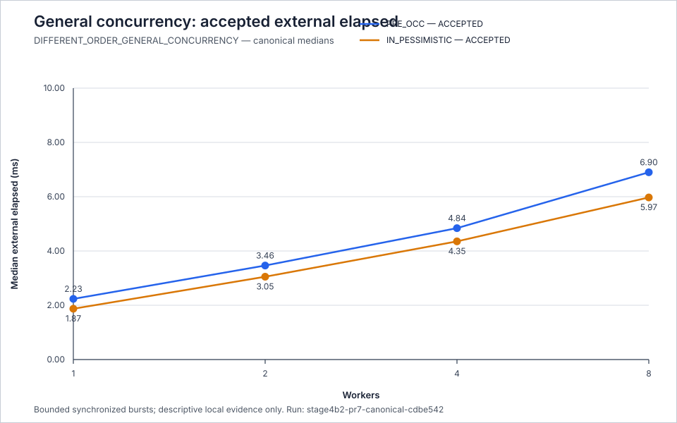
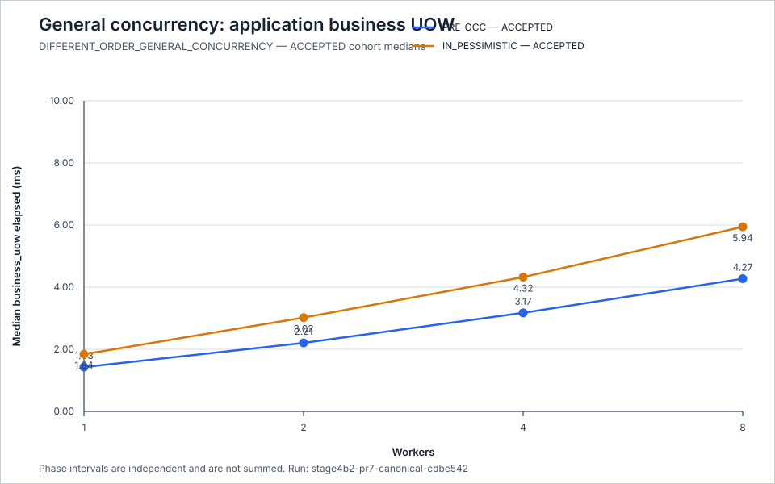
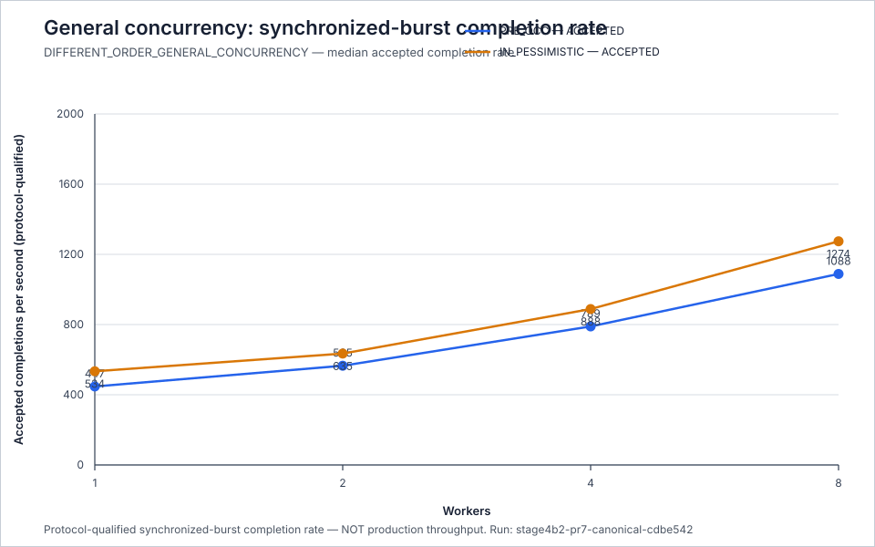
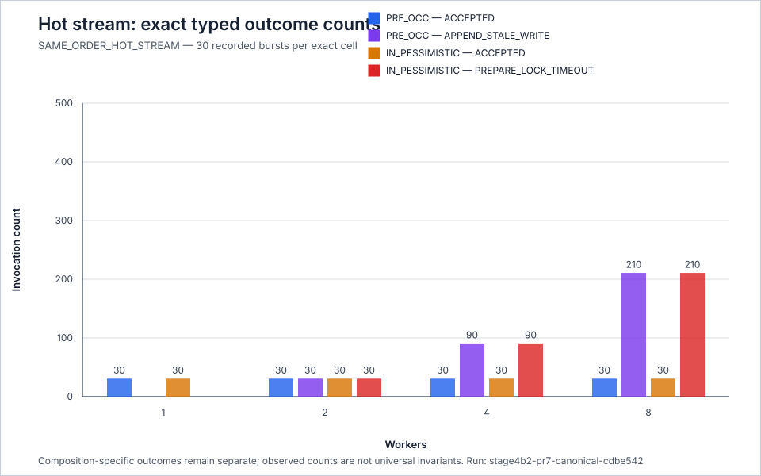
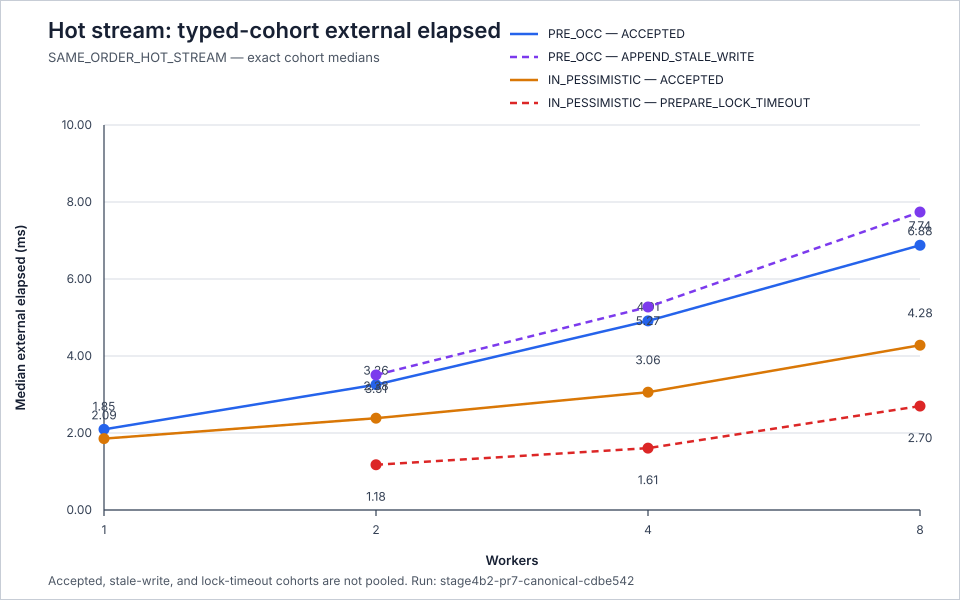
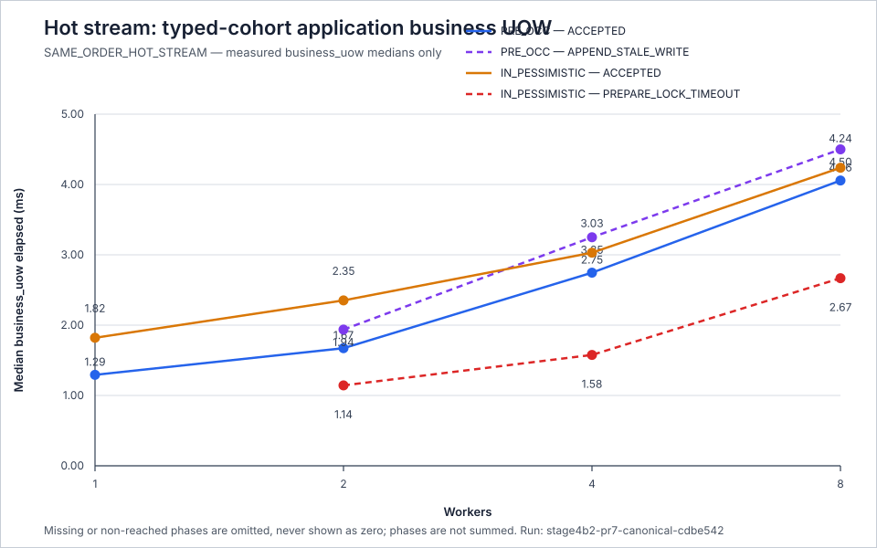
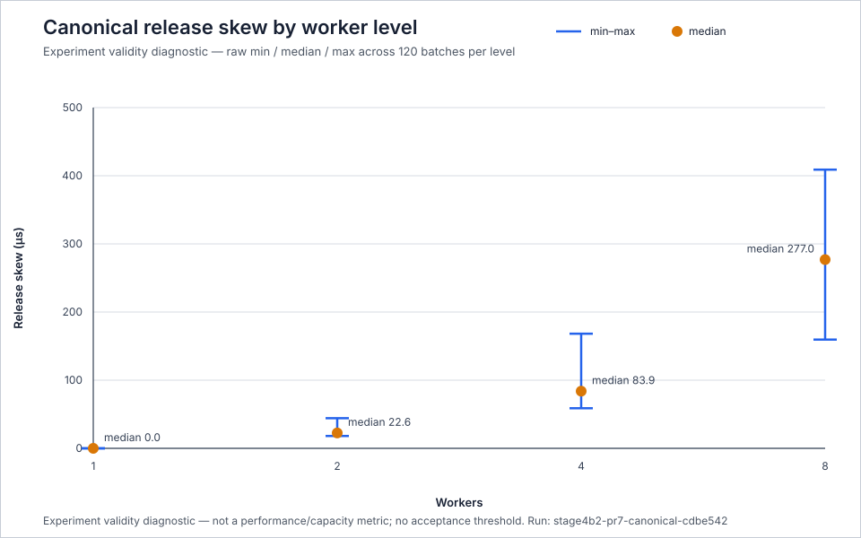

# PostgreSQL Bounded Concurrency Report

[← Back to Stage 4B.2](README.md)

## Status

```text
PR7
= COMPLETE / CLOSED

canonical Level-C evidence
= VALID

canonical release-skew review
= ACCEPTED FOR CANONICAL INTERPRETATION

PostgreSQL rerun
= NOT REQUIRED

production policy
= NONE
```

This report answers one bounded empirical question. It does not select a
strategy or establish production capacity, sustained throughput, safe
concurrency, an SLO, a rate limit, a connection-pool size, autoscaling, or a
production admission policy.

## Question

How did the two current PostgreSQL compositions behave under bounded
synchronized concurrent demand at worker levels `1`, `2`, `4`, and `8`?

```text
PRE_OCC
= PRE_TRANSACTION
+ current optimistic/OCC append-time admission

IN_PESSIMISTIC
= IN_TRANSACTION
+ current PostgreSQL pessimistic admission
```

The two workload families remain separate throughout this report:

```text
DIFFERENT_ORDER_GENERAL_CONCURRENCY
!= SAME_ORDER_HOT_STREAM
```

## Evidence Lineage

The committed canonical evidence is:

```text
run ID
= stage4b2-pr7-canonical-cdbe542

canonical source commit
= cdbe542a6cf557b5524070e4045165d1764b2ebf

evidence commit
= 276a486d8e19459755f82078c797d75c96f32852

validation
= VALID

unexpected exceptions
= 0
```

Evidence directory:

```text
experiments/stage4b2/evidence/
stage4b2-pr7-canonical-levelc/
stage4b2-pr7-canonical-cdbe542/
```

The directory contains exactly the six contracted files. The committed
manifest records a clean source tree before execution, schedule seed `73`,
PostgreSQL server version `160014`, `READ_COMMITTED` isolation,
`autocommit = false`, and topology label `guarded-test-postgresql`. The raw and
aggregate records contain `1,800` invocations, `480` batches, `15` ownership
observations, and `16` batch-rate groups.

## Experiment Shape

```text
retained worker levels
= 1, 2, 4, 8

workload families
= DIFFERENT_ORDER_GENERAL_CONCURRENCY
  SAME_ORDER_HOT_STREAM

compositions
= PRE_OCC
  IN_PESSIMISTIC

exact cells
= 16

warmup batches per exact cell
= 3

recorded batches per exact cell
= 30
```

For worker level `N`, the runtime used `N` persistent threads, `N` persistent
PostgreSQL connections, and `N` fixed lane owners. Each recorded batch was one
bounded synchronized burst. Completion-rate values below are therefore
protocol-qualified synchronized-burst completion rates, not production
throughput.

All elapsed tables display milliseconds rounded to three decimal places from
the canonical nanosecond observations. Rate tables display completions per
second rounded to three decimal places. Counts are exact. No p95 or summed
phase value is reported.

## General Concurrency — Different Orders

Every `DIFFERENT_ORDER_GENERAL_CONCURRENCY` invocation was in the exact
`ACCEPTED` cohort for both compositions at every retained worker level.

### Accepted external elapsed

| Workers | Composition | Count | Min ms | Mean ms | Median ms | Max ms |
| ---: | --- | ---: | ---: | ---: | ---: | ---: |
| 1 | `PRE_OCC` | 30 | 1.927 | 2.457 | 2.235 | 3.686 |
| 1 | `IN_PESSIMISTIC` | 30 | 1.643 | 2.017 | 1.872 | 3.260 |
| 2 | `PRE_OCC` | 60 | 2.463 | 3.566 | 3.464 | 5.043 |
| 2 | `IN_PESSIMISTIC` | 60 | 2.001 | 2.996 | 3.052 | 4.210 |
| 4 | `PRE_OCC` | 120 | 3.328 | 5.195 | 4.841 | 7.497 |
| 4 | `IN_PESSIMISTIC` | 120 | 2.425 | 4.327 | 4.354 | 9.671 |
| 8 | `PRE_OCC` | 240 | 4.569 | 7.098 | 6.900 | 9.463 |
| 8 | `IN_PESSIMISTIC` | 240 | 4.641 | 6.198 | 5.972 | 10.830 |



Median accepted external elapsed increased monotonically with worker level for
both compositions. The progression was nonlinear: it rose from `2.235 ms` to
`6.900 ms` for `PRE_OCC` and from `1.872 ms` to `5.972 ms` for
`IN_PESSIMISTIC` between one and eight workers.

### Accepted application `business_uow`

| Workers | Composition | Count | Min ms | Mean ms | Median ms | Max ms |
| ---: | --- | ---: | ---: | ---: | ---: | ---: |
| 1 | `PRE_OCC` | 30 | 1.196 | 1.618 | 1.427 | 2.889 |
| 1 | `IN_PESSIMISTIC` | 30 | 1.610 | 1.986 | 1.841 | 3.231 |
| 2 | `PRE_OCC` | 60 | 1.497 | 2.270 | 2.205 | 4.052 |
| 2 | `IN_PESSIMISTIC` | 60 | 1.972 | 2.963 | 3.021 | 4.155 |
| 4 | `PRE_OCC` | 120 | 1.940 | 3.309 | 3.174 | 5.260 |
| 4 | `IN_PESSIMISTIC` | 120 | 2.392 | 4.294 | 4.324 | 9.623 |
| 8 | `PRE_OCC` | 240 | 2.936 | 4.331 | 4.272 | 7.104 |
| 8 | `IN_PESSIMISTIC` | 240 | 4.597 | 6.164 | 5.944 | 10.797 |



Median `business_uow` elapsed also increased monotonically. The current
`PRE_OCC` composition recorded lower `business_uow` medians than the current
`IN_PESSIMISTIC` composition at every retained level, while its external
elapsed medians were higher. That contrast is evidence about where the current
compositions placed measured work; it is not a strategy recommendation.

### Accepted and all synchronized-burst completion rates

Because every general-concurrency invocation was accepted, accepted-completion
and all-completion rate observations are exactly identical within every cell.
The following table therefore reports both distributions without pooling
compositions.

| Workers | Composition | Count | Min /s | Mean /s | Median /s | Max /s |
| ---: | --- | ---: | ---: | ---: | ---: | ---: |
| 1 | `PRE_OCC` | 30 | 271.202 | 423.683 | 447.193 | 518.605 |
| 1 | `IN_PESSIMISTIC` | 30 | 306.623 | 511.126 | 533.826 | 608.349 |
| 2 | `PRE_OCC` | 30 | 396.465 | 567.828 | 565.367 | 767.018 |
| 2 | `IN_PESSIMISTIC` | 30 | 474.867 | 682.262 | 634.670 | 948.055 |
| 4 | `PRE_OCC` | 30 | 531.264 | 767.183 | 789.350 | 1,130.942 |
| 4 | `IN_PESSIMISTIC` | 30 | 409.247 | 932.838 | 888.372 | 1,362.533 |
| 8 | `PRE_OCC` | 30 | 824.810 | 1,075.565 | 1,088.411 | 1,297.552 |
| 8 | `IN_PESSIMISTIC` | 30 | 726.838 | 1,231.432 | 1,274.413 | 1,483.382 |



Median synchronized-burst completion rates increased at each retained level,
but much less than proportionally to the increase from one to eight workers.
The tested range therefore shows diminishing bounded scaling alongside rising
latency, not a production throughput or capacity result.

### Batch elapsed

| Workers | Composition | Count | Min ms | Mean ms | Median ms | Max ms |
| ---: | --- | ---: | ---: | ---: | ---: | ---: |
| 1 | `PRE_OCC` | 30 | 1.928 | 2.459 | 2.236 | 3.687 |
| 1 | `IN_PESSIMISTIC` | 30 | 1.644 | 2.019 | 1.873 | 3.261 |
| 2 | `PRE_OCC` | 30 | 2.608 | 3.637 | 3.538 | 5.045 |
| 2 | `IN_PESSIMISTIC` | 30 | 2.110 | 3.068 | 3.152 | 4.212 |
| 4 | `PRE_OCC` | 30 | 3.537 | 5.387 | 5.068 | 7.529 |
| 4 | `IN_PESSIMISTIC` | 30 | 2.936 | 4.536 | 4.504 | 9.774 |
| 8 | `PRE_OCC` | 30 | 6.165 | 7.552 | 7.350 | 9.699 |
| 8 | `IN_PESSIMISTIC` | 30 | 5.393 | 6.652 | 6.277 | 11.007 |

Batch elapsed increased with workers for both compositions and remained
coherent with the invocation distributions. No tested point showed a declining
median completion rate or a release-harness-driven batch duration.

## Hot-Stream Contention — Same Order

### Exact typed outcome counts

| Workers | Composition | `ACCEPTED` | Composition-specific rejection |
| ---: | --- | ---: | ---: |
| 1 | `PRE_OCC` | 30 | 0 `APPEND_STALE_WRITE` |
| 1 | `IN_PESSIMISTIC` | 30 | 0 `PREPARE_LOCK_TIMEOUT` |
| 2 | `PRE_OCC` | 30 | 30 `APPEND_STALE_WRITE` |
| 2 | `IN_PESSIMISTIC` | 30 | 30 `PREPARE_LOCK_TIMEOUT` |
| 4 | `PRE_OCC` | 30 | 90 `APPEND_STALE_WRITE` |
| 4 | `IN_PESSIMISTIC` | 30 | 90 `PREPARE_LOCK_TIMEOUT` |
| 8 | `PRE_OCC` | 30 | 210 `APPEND_STALE_WRITE` |
| 8 | `IN_PESSIMISTIC` | 30 | 210 `PREPARE_LOCK_TIMEOUT` |



The canonical run reproduced one accepted invocation per recorded hot-stream
burst and composition, with the remaining invocations in the corresponding
typed rejection cohort at levels `2`, `4`, and `8`. This is one bounded
recorded observation. It is not promoted to a universal `1 + (N - 1)` outcome
invariant.

### Exact typed-cohort external elapsed

| Workers | Composition | Cohort | Count | Min ms | Mean ms | Median ms | Max ms |
| ---: | --- | --- | ---: | ---: | ---: | ---: | ---: |
| 1 | `PRE_OCC` | `ACCEPTED` | 30 | 1.830 | 2.402 | 2.095 | 4.288 |
| 2 | `PRE_OCC` | `ACCEPTED` | 30 | 2.487 | 3.312 | 3.256 | 6.136 |
| 2 | `PRE_OCC` | `APPEND_STALE_WRITE` | 30 | 2.708 | 3.559 | 3.508 | 6.383 |
| 4 | `PRE_OCC` | `ACCEPTED` | 30 | 3.373 | 4.906 | 4.912 | 6.383 |
| 4 | `PRE_OCC` | `APPEND_STALE_WRITE` | 90 | 3.701 | 5.388 | 5.273 | 6.941 |
| 8 | `PRE_OCC` | `ACCEPTED` | 30 | 5.477 | 6.826 | 6.877 | 8.777 |
| 8 | `PRE_OCC` | `APPEND_STALE_WRITE` | 210 | 5.898 | 7.632 | 7.739 | 9.740 |
| 1 | `IN_PESSIMISTIC` | `ACCEPTED` | 30 | 1.579 | 2.003 | 1.854 | 2.997 |
| 2 | `IN_PESSIMISTIC` | `ACCEPTED` | 30 | 1.828 | 2.583 | 2.385 | 7.211 |
| 2 | `IN_PESSIMISTIC` | `PREPARE_LOCK_TIMEOUT` | 30 | 0.911 | 1.433 | 1.175 | 6.037 |
| 4 | `IN_PESSIMISTIC` | `ACCEPTED` | 30 | 2.344 | 3.110 | 3.060 | 4.792 |
| 4 | `IN_PESSIMISTIC` | `PREPARE_LOCK_TIMEOUT` | 90 | 1.133 | 1.840 | 1.607 | 3.550 |
| 8 | `IN_PESSIMISTIC` | `ACCEPTED` | 30 | 3.196 | 4.401 | 4.280 | 5.740 |
| 8 | `IN_PESSIMISTIC` | `PREPARE_LOCK_TIMEOUT` | 210 | 1.468 | 2.795 | 2.700 | 4.388 |



`PRE_OCC` stale-write invocations returned only after reaching append
admission, and their median external elapsed remained close to or above the
corresponding accepted median. `IN_PESSIMISTIC` lock-timeout invocations
returned with materially shorter median external elapsed than their accepted
cohort at levels `2`, `4`, and `8`. These are current resource-placement and
early-exit observations, not an equivalence between rejection outcomes or a
universal strategy ranking.

## Phase-Level Observations

Every value below is an independently measured phase median. The intervals are
not summed. An em dash means the phase was not applicable or not reached for
that exact cohort; it does not mean measured zero.

### `PRE_OCC` phase medians

| Workers | Cohort | Preliminary idempotency ms | Preliminary cleanup ms | History load ms | Business UOW ms | Append admission ms | Rollback ms | Commit ms |
| ---: | --- | ---: | ---: | ---: | ---: | ---: | ---: | ---: |
| 1 | `ACCEPTED` | 0.373 | 0.142 | 0.188 | 1.294 | 0.433 | — | 0.271 |
| 2 | `ACCEPTED` | 0.552 | 0.215 | 0.248 | 1.672 | 0.542 | — | 0.323 |
| 2 | `APPEND_STALE_WRITE` | 0.570 | 0.229 | 0.261 | 1.937 | 1.222 | 0.158 | — |
| 4 | `ACCEPTED` | 0.747 | 0.328 | 0.374 | 2.746 | 0.746 | — | 0.436 |
| 4 | `APPEND_STALE_WRITE` | 0.828 | 0.316 | 0.365 | 3.250 | 1.887 | 0.279 | — |
| 8 | `ACCEPTED` | 0.989 | 0.549 | 0.531 | 4.057 | 1.366 | — | 0.739 |
| 8 | `APPEND_STALE_WRITE` | 1.299 | 0.660 | 0.641 | 4.500 | 2.491 | 0.439 | — |

### `IN_PESSIMISTIC` phase medians

| Workers | Cohort | Authoritative idempotency ms | Advisory try-lock ms | History load ms | Business UOW ms | Append admission ms | Rollback ms | Commit ms |
| ---: | --- | ---: | ---: | ---: | ---: | ---: | ---: | ---: |
| 1 | `ACCEPTED` | 0.389 | 0.176 | 0.197 | 1.821 | 0.469 | — | 0.280 |
| 2 | `ACCEPTED` | 0.551 | 0.226 | 0.272 | 2.352 | 0.466 | — | 0.283 |
| 2 | `PREPARE_LOCK_TIMEOUT` | 0.583 | 0.259 | — | 1.143 | — | 0.204 | — |
| 4 | `ACCEPTED` | 0.746 | 0.328 | 0.351 | 3.030 | 0.520 | — | 0.300 |
| 4 | `PREPARE_LOCK_TIMEOUT` | 0.783 | 0.332 | — | 1.576 | — | 0.301 | — |
| 8 | `ACCEPTED` | 0.948 | 0.567 | 0.543 | 4.238 | 0.905 | — | 0.442 |
| 8 | `PREPARE_LOCK_TIMEOUT` | 1.275 | 0.585 | — | 2.668 | — | 0.482 | — |



The phase topology makes the observed placement distinction concrete:

- `PRE_OCC` measured preliminary idempotency and preliminary read cleanup, then
  performed authoritative/history work and append admission inside the later
  write-side path. Hot-stream stale writers reached history and append
  admission before rollback.
- `IN_PESSIMISTIC` hot-stream contenders that failed the advisory try-lock did
  not reach accepted-history loading or append admission. Their rollback
  followed authoritative idempotency and the pessimistic admission attempt.

The evidence describes the current compositions. It does not prescribe which
placement another workload or production environment should use.

## Release-Skew Validity Review

Canonical per-level release-skew observations were:

| Workers | Batches | Invocations | Min ns | Mean ns | Median ns | Max ns |
| ---: | ---: | ---: | ---: | ---: | ---: | ---: |
| 1 | 120 | 120 | 0 | 0 | 0 | 0 |
| 2 | 120 | 240 | 18,125 | 23,159.033 | 22,562.5 | 44,209 |
| 4 | 120 | 480 | 58,833 | 86,099.300 | 83,875 | 168,208 |
| 8 | 120 | 960 | 159,583 | 281,556.917 | 276,958 | 408,958 |



The most notable reviewed exact cell was worker level `8`,
`SAME_ORDER_HOT_STREAM`, `IN_PESSIMISTIC`:

```text
median release skew / median batch elapsed
≈ 6.717%

median release skew / median invocation elapsed
≈ 10.301%

largest observed per-batch relative diagnostics
≈ 9.57% of batch elapsed
≈ 16.80% of that batch's median invocation elapsed
```

```text
human review
= ACCEPTED FOR CANONICAL INTERPRETATION

reason
= No concrete cell showed release coordination overtaking or obviously
  dominating producer or batch timing.
```

The percentages are review-only diagnostics calculated from raw canonical
observations. They are not evidence fields, thresholds, production metrics, or
capacity metrics. PR7 defines no universal acceptable-skew percentage.

Canonical skew remained on the same general scale as the accepted PostgreSQL
smoke: exact equality was not required, and the repeated canonical ranges were
coherent with the one-burst smoke ranges at every retained level. Smoke latency
does not enter this performance analysis; smoke remains correctness and
topology evidence only.

## Evidence Before Future Load Admission

PR7 exists partly so later load-admission or rate-limiting work does not begin
from an arbitrary number. The canonical evidence now provides environment-
qualified empirical inputs including:

- four bounded in-flight worker levels;
- accepted latency behavior under independent-stream concurrency;
- protocol-qualified synchronized-burst completion behavior;
- exact same-order contention outcomes and early/late rejection placement; and
- release-skew and harness-validity observations.

It does not convert those observations into requests per second, a rate limit,
safe concurrency, queue depth, connection-pool size, admission threshold, or
SLO.

```text
future load-admission policy
may consume PR7 evidence

but

PR7 evidence
!= production load-admission policy
```

Any future policy requires a separately owned method, workload and arrival
model, production constraints, safety margin, and explicit human decision.

## What This Evidence Does Not Prove

The canonical run does not establish:

- universal superiority of `PRE_OCC` or `IN_PESSIMISTIC`;
- production capacity or a saturation point;
- sustained or open-loop production throughput;
- maximum safe production concurrency;
- a rate limit, SLO, autoscaling rule, or queue depth;
- connection-pool sizing;
- automatic strategy selection or switching;
- retry or idempotency policy; or
- transferability to a different server, topology, schema, workload, or
  environment.

The tested range shows increasing accepted latency and diminishing completion
gains as worker count rises. That is bounded nonlinear behavior inside levels
`1`, `2`, `4`, and `8`; it is not evidence of a production saturation capacity
or maximum safe concurrency. No unambiguous completion-rate plateau or decline
appeared by worker level `8`.

## Deferred Experiment-Harness Maintenance

### POSIX publication locking

The canonical evidence writer uses `fcntl.flock(...)`:

- it is a Python standard-library POSIX facility;
- it works for the current macOS/Linux experiment workflow;
- it is not natively portable to Windows;
- it is experiment-harness portability debt only;
- it has no current production impact;
- it is not a current evidence-validity blocker; and
- it is deferred.

### Conservative secret-marker sanitization

The canonical evidence schema intentionally rejects broad secret and
connection markers:

- the behavior is fail-closed by design;
- it could theoretically reject an unusual but benign sanitized string;
- it had no impact on the canonical run;
- it is experiment-harness ergonomics debt; and
- it is deferred.

Reconsider these observations only if the experiment harness becomes
long-lived shared tooling, requires native Windows support, or needs wider
metadata vocabularies. Neither is changed by PR7 closeout.

## Closeout Decision

```text
PR7 question
= ANSWERED WITH VALID ENVIRONMENT-QUALIFIED LEVEL-C EVIDENCE

canonical release-skew review
= ACCEPTED FOR CANONICAL INTERPRETATION

PR7
= COMPLETE / CLOSED

PR8
= NEXT / STAGE 4B.2 CLOSEOUT

production policy
= NONE
```

PR7 closes without another PostgreSQL run. PR8 remains responsible for the
final Stage 4B.2 closeout record; Stage 4B.2 is therefore not marked complete
by this report alone.
