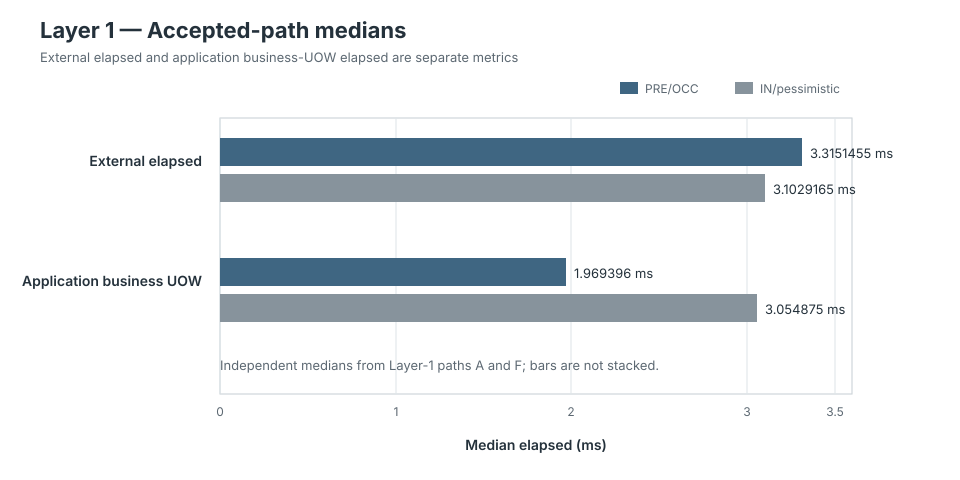
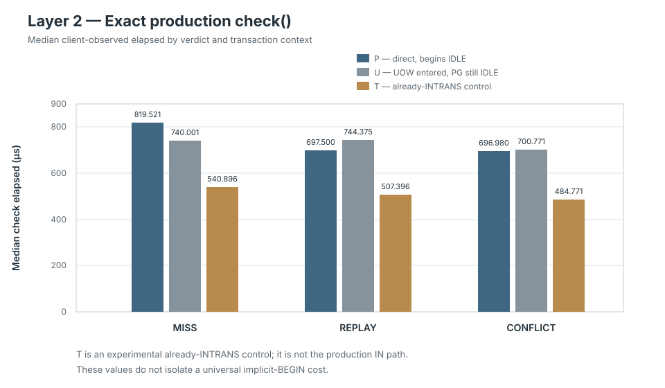
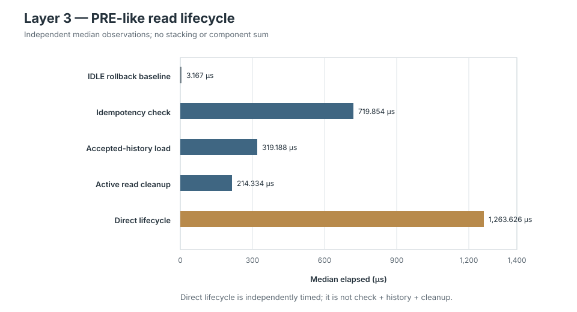

# PostgreSQL Idempotency and Transaction-Lifecycle Supplemental Report

[← Back to Stage 4B.2](README.md)

## Status

```text
Canonical PR6
= COMPLETE / CLOSED / UNCHANGED

Post-PR6 supplemental characterization
= COMPLETE / CLOSED

Layer 1
= IMPLEMENTED / EXECUTED / VALID / EVIDENCE RECORDED

Layer 2
= IMPLEMENTED / EXECUTED / VALID / EVIDENCE RECORDED

Layer 3
= IMPLEMENTED / EXECUTED / VALID / EVIDENCE RECORDED

Production architecture change
= NONE
```

This is a final evidence report for the bounded post-PR6 explanatory
supplement. It is not a new method, a reopening of PR6, or a production
strategy decision.

## Question

The supplement answers one question:

> Why could the current PRE/OCC accepted path have slightly higher observed
> external end-to-end latency while having a materially shorter write-side
> application business-UOW interval than the current IN/pessimistic path?

It does not decide which strategy is universally better, whether preliminary
idempotency should be removed, whether IN/OCC would win, what percentage of the
PR6 difference was caused by one operation, or what production latency or rate
policy should be.

The evidence responsibilities remain distinct:

```text
PR6
= complete-composition comparison

Layer 1
= current production-path lifecycle evidence

Layer 2
= exact production idempotency-check / transaction-context evidence

Layer 3
= isolated PRE-like preliminary read-lifecycle evidence

comparison
!= explanation

end-to-end elapsed
!= application business-UOW elapsed

application business-UOW elapsed
!= physical PostgreSQL transaction lifetime

client-observed check/cleanup elapsed
!= server-side SQL execution time
```

## Evidence Lineage

| Evidence | Run ID | Recorded source | Evidence commit | Samples | Result |
|---|---|---|---|---:|---|
| Canonical PR6 | `stage4b2-pr6-canonical-0bd2f51` | `0bd2f515bcc49e8e1f0e9d2f9dba4a294adadd0d` | `16d436670ac5fb502e7740fb4b40f5e87fa3069e` | 450 | `VALID`, 0 exceptions |
| Layer 1 | `stage4b2-post-pr6-idempotency-layer1-0db85c3` | `0db85c3cb0d155566adf5531b0be5ead7a42ec8c` | `997eb3c7572f9f8afd6f7a56823a679275a15382` | 80 | `VALID`, 0 exceptions |
| Layer 2 | `stage4b2-post-pr6-idempotency-layer2-9d2e4ac` | `9d2e4ac80cdf33b5dcd3638fa29ceb74d54bc8fd` | `ba5224168802ed9b59c14fe0ff511d8af739d46a` | 270 | `VALID`, 0 exceptions |
| Layer 3 | `stage4b2-post-pr6-idempotency-layer3-b5e57f1` | `b5e57f1b18eb8f484225d0dc745e9c9cc1f620aa` | `8b3c50c20068eb74279d8cee6770ac3af1fccac0` | 60 | `VALID`, 0 exceptions |

The committed artifacts consumed by this report are:

- canonical PR6 [manifest](../../../experiments/stage4b2/evidence/stage4b2-pr6-canonical-0bd2f51/manifest.json), [samples](../../../experiments/stage4b2/evidence/stage4b2-pr6-canonical-0bd2f51/samples.jsonl), and [aggregates](../../../experiments/stage4b2/evidence/stage4b2-pr6-canonical-0bd2f51/aggregates.json);
- Layer 1 [manifest](../../../experiments/stage4b2/evidence/stage4b2-post-pr6-idempotency-lifecycle-layer1/stage4b2-post-pr6-idempotency-layer1-0db85c3/manifest.json), [samples](../../../experiments/stage4b2/evidence/stage4b2-post-pr6-idempotency-lifecycle-layer1/stage4b2-post-pr6-idempotency-layer1-0db85c3/samples.jsonl), and [aggregates](../../../experiments/stage4b2/evidence/stage4b2-post-pr6-idempotency-lifecycle-layer1/stage4b2-post-pr6-idempotency-layer1-0db85c3/aggregates.json);
- Layer 2 [manifest](../../../experiments/stage4b2/evidence/stage4b2-post-pr6-idempotency-check-layer2/stage4b2-post-pr6-idempotency-layer2-9d2e4ac/manifest.json), [samples](../../../experiments/stage4b2/evidence/stage4b2-post-pr6-idempotency-check-layer2/stage4b2-post-pr6-idempotency-layer2-9d2e4ac/samples.jsonl), and [aggregates](../../../experiments/stage4b2/evidence/stage4b2-post-pr6-idempotency-check-layer2/stage4b2-post-pr6-idempotency-layer2-9d2e4ac/aggregates.json); and
- Layer 3 [manifest](../../../experiments/stage4b2/evidence/stage4b2-post-pr6-idempotency-read-lifecycle-layer3/stage4b2-post-pr6-idempotency-layer3-b5e57f1/manifest.json), [samples](../../../experiments/stage4b2/evidence/stage4b2-post-pr6-idempotency-read-lifecycle-layer3/stage4b2-post-pr6-idempotency-layer3-b5e57f1/samples.jsonl), and [aggregates](../../../experiments/stage4b2/evidence/stage4b2-post-pr6-idempotency-read-lifecycle-layer3/stage4b2-post-pr6-idempotency-layer3-b5e57f1/aggregates.json).

All values below were read from those artifacts and cross-checked against the
raw JSONL samples. Units are converted for readability; the committed evidence
retains nanoseconds.

## Canonical PR6 Observation

PR6 compared complete current production compositions under its fixed
Scenario-A measured accepted workload:

| Composition | Count | External median |
|---|---:|---:|
| PRE/OCC | 30 | 2.862083 ms |
| IN/pessimistic | 30 | 2.509333 ms |

The canonical paired `IN - PRE` median was `-0.3199375 ms`, reported by PR6 as
`-11.18%` relative to the PRE median. This is the accepted complete-composition
ordering in that recorded environment. It is not causal attribution to
validation placement, idempotency, transaction start, or admission.

## Layer 1 — Production-Path Evidence

Layer 1 executed the exact A–H production-path schedule: 10 samples per path,
80 total, all measurement delivery `AVAILABLE`, all connections IDLE and
reusable after normal return, all durable verification true, and no exceptions.

For the fresh accepted paths:

| Median metric | A — PRE/OCC | F — IN/pessimistic |
|---|---:|---:|
| External elapsed | 3.3151455 ms | 3.1029165 ms |
| Write-side application `business_uow` | 1.969396 ms | 3.054875 ms |

Thus the Layer-1 accepted samples preserve both observations:

```text
PRE external elapsed
> IN external elapsed

while

PRE write-side application business-UOW elapsed
< IN write-side application business-UOW elapsed
```

The figure shows the two metrics separately; neither bar is stacked or treated
as a component of the other.



Path A also observed median preliminary idempotency-check elapsed of
`614.4165 µs` and preliminary read-cleanup elapsed of `207.8335 µs` before its
business UOW. Those are overlapping client-observed production phase
intervals, not additive database-time components.

Layer 1 also established the early-exit value of the preliminary classifier:

| Path | Result | External median | Business UOW reached? |
|---|---|---:|---|
| B — PRE preliminary REPLAY | `REPLAY` | 902.646 µs | No |
| C — PRE preliminary CONFLICT | `CONFLICT` | 960.1875 µs | No |
| G — IN authoritative REPLAY | `REPLAY` | 1.075021 ms | Yes |
| H — IN authoritative CONFLICT | `CONFLICT` | 1.0530415 ms | Yes |

The D/E outer, producer, and validation timings remain coordination-contaminated
and are not used for latency interpretation. Their valid structural evidence
still proves late authoritative REPLAY/CONFLICT after a preliminary MISS.

## Layer 2 — Exact Idempotency Check

Layer 2 recorded 30 samples in each exact context/verdict cell, 270 total. All
returned verdicts matched their fixtures, reuse succeeded in 270/270 samples,
all final transaction states were IDLE, and there were no exceptions.

The contexts mean:

```text
P
= direct production check beginning IDLE

U
= application UOW entered while the physical PostgreSQL transaction is IDLE

T
= experimental already-INTRANS control
!= current production IN composition
```

The exact recorded medians were:

| Cell | `check()` median | Cleanup median |
|---|---:|---:|
| P-MISS | 819.521 µs | 231.1045 µs |
| P-REPLAY | 697.4995 µs | 228.2915 µs |
| P-CONFLICT | 696.9795 µs | 226.6255 µs |
| U-MISS | 740.0005 µs | 231.854 µs |
| U-REPLAY | 744.3745 µs | 241.7085 µs |
| U-CONFLICT | 700.771 µs | 220.125 µs |
| T-MISS | 540.8955 µs | 234.500 µs |
| T-REPLAY | 507.3955 µs | 222.333 µs |
| T-CONFLICT | 484.771 µs | 212.8755 µs |



P versus U did not produce one stable directional difference: U was lower for
MISS, higher for REPLAY, and slightly higher for CONFLICT. The evidence
therefore does not support application-UOW entry alone as the main explanation
for PR6.

The already-INTRANS T check median was lower than U for all three verdicts in
this recorded environment. T is an experimental lifecycle control, not the
production IN composition. Layer 2 does not isolate or quantify one universal
implicit-`BEGIN` cost, and no such value is inferred here.

Layer-2 `check()` elapsed includes client/driver work, SQL round trip, fetch,
fingerprint comparison, and row/event materialization where applicable. Its
cleanup elapsed is a separate finalization-call boundary. Neither is
server-side SQL execution time, and they are not added into a synthetic total.

## Layer 3 — Preliminary Read Lifecycle

Layer 3 recorded this exact evidence identity:

```text
run ID
= stage4b2-post-pr6-idempotency-layer3-b5e57f1

source commit
= b5e57f1b18eb8f484225d0dc745e9c9cc1f620aa

samples
= 60

CONTROL_A_IDLE_ROLLBACK
= 30

CONTROL_B_PRELIMINARY_READ_LIFECYCLE
= 30

validation
= VALID

exceptions
= 0
```

All Control-B samples returned MISS, loaded empty accepted history, followed
`IDLE → INTRANS → INTRANS → IDLE`, succeeded at reuse `SELECT 1`, and ended
IDLE. The exact descriptive values were:

| Control and independently measured field | Min | Mean | Median | Max |
|---|---:|---:|---:|---:|
| Control A — IDLE rollback cleanup | 1.416 µs | 3.775 µs | 3.167 µs | 8.208 µs |
| Control B — idempotency check | 550.917 µs | 774.167 µs | 719.854 µs | 1,930.792 µs |
| Control B — accepted-history load | 217.667 µs | 328.018 µs | 319.1875 µs | 478.250 µs |
| Control B — active read cleanup | 169.083 µs | 264.271 µs | 214.3335 µs | 1,169.917 µs |
| Control B — direct lifecycle | 974.375 µs | 1,377.518 µs | 1,263.6255 µs | 2,542.042 µs |



The direct lifecycle was independently timed from immediately before the
idempotency check until immediately after rollback. It was not derived by
adding component values. The component scales are coherent with the outer
observation, but they do not form a synthetic database-time metric.

The IDLE rollback baseline is much smaller than the active Control-B cleanup
observation in this run. That is bounded lifecycle evidence; it is not a
universal decomposition of driver, protocol, server, or physical transaction
cost.

## Cross-Layer Interpretation

The complete evidence is coherent with the current PRE/OCC accepted path paying
an additional pre-business-UOW durable read lifecycle:

```text
preliminary idempotency lookup
→ accepted-history load
→ cleanup of the resulting read transaction
```

Layer 1 proves that the current accepted PRE path reaches this work before its
business UOW. Layer 2 shows that the exact production idempotency check and
cleanup boundaries have non-negligible client-observed elapsed under the
recorded transaction contexts. Layer 3 directly measures the isolated PRE-like
MISS/empty-history/read-cleanup lifecycle at a median `1.2636255 ms` in its own
recorded run.

At the same time, PRE keeps validation and its preliminary history-related work
outside the write-side application business UOW. The PRE write-side
application business-UOW interval can therefore remain materially shorter than
IN's even when the complete PRE request elapsed is slightly higher.

Consequently:

```text
higher PRE external latency
+
shorter PRE application business-UOW lifetime
= coherent, non-contradictory observations
```

This supports the bounded explanation that additional pre-UOW durable read
lifecycle work materially contributes to current PRE accepted-path elapsed in
the recorded environment. It does not prove all of the PR6 delta, assign a
causal percentage, or fully decompose PostgreSQL time.

## Early-Exit Trade-off

Preliminary idempotency is not pure accepted-path overhead. Layer 1 shows that
the current PRE path can classify already-known REPLAY and CONFLICT identities
before reaching validation and the later business UOW. The supplement therefore
does not establish safe removal of preliminary idempotency and makes no
optimization recommendation.

## What the Evidence Does Not Prove

The combined evidence does not establish:

- universal PRE inferiority or IN superiority;
- a production strategy choice or architecture change;
- a causal percentage of the PR6 end-to-end difference;
- a synthetic total database-time metric;
- exact physical PostgreSQL transaction duration or lock occupancy;
- one universal physical-transaction-start cost;
- server-side SQL execution time from client-observed timers;
- safe removal, bypass, or reordering of either idempotency check;
- production latency, throughput, capacity, or rate policy; or
- how an unimplemented counterfactual composition would perform.

All results remain source-, workload-, and environment-qualified.

## Deferred Questions

```text
PRE_NO_PRELIMINARY
= DEFERRED / NOT REQUIRED FOR CLOSEOUT

IN_OCC
= DEFERRED / NOT REQUIRED FOR CLOSEOUT
```

Neither is required for experimental symmetry. A future human review may open
a new question only if it identifies a specific contradictory or unexplained
observation. This closeout authorizes no further experiment.

## Deferred Experiment-Harness Maintenance

Layer-3 experiment code currently reuses these Layer-2 private helpers:

```text
_open_guarded_connections
_reset_database
_close_connections
_guard_test_connection
```

The accepted classification is:

```text
impact
= experiment-harness maintenance only

production impact
= none

current evidence-validity impact
= none known

resolution
= deferred
```

Reconsider this coupling only if the experiment harness becomes long-lived
shared infrastructure, additional experiment modules begin depending on the
same private helpers, or Layer-2 internals require significant refactoring or
removal. This is not a production correctness defect and is not a blocker for
the recorded evidence.

## Closeout Decision

```text
POST-PR6 SUPPLEMENTAL CHARACTERIZATION
= COMPLETE / CLOSED
```

The existing method's closeout rule is satisfied:

- Layer 1 is valid and establishes current production-path placement;
- Layer 2 is valid and establishes non-negligible exact idempotency-check and
  transaction-context observations;
- Layer 3 is valid and directly characterizes the isolated PRE-like
  preliminary read lifecycle;
- the cross-layer observations are coherent and no concrete contradiction
  requires another control; and
- closure requires no arbitrary causal percentage threshold.

Canonical PR6 remains complete and unchanged. `PRE_NO_PRELIMINARY` and
`IN_OCC` remain deferred and are not required. No production architecture
change was made, and no further supplemental PostgreSQL execution or new
experimental scope is authorized by this closeout.
